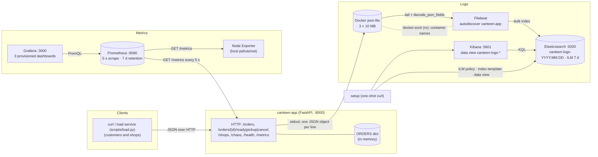

# canteen — Observability report

Enterprise Software Development, Fall 2026 — Assignment 1. Individual submission.

Code, compose stack, dashboards, scripts and raw results are in this directory. `README.md` explains how to start, use, test and clean up; screenshots are in `docs/screenshots/`.

---

## A. Project

**Problem.** A university has four food shops (Sky Dhaba, Tapal, Cafetogo, Grito) and one crowd. Nobody knows how long a line is, and when a shop is slow or closed the only signal is people complaining.

**Users.** Students placing orders and shop staff marking them ready. No login; an order is identified by its id.

**Solution.** `canteen`: one FastAPI service with an in-memory dict. Four shops (`sky_dhaba`: chai, pharata; `tapal`: biryani, pulao; `cafetogo`: burger, roll; `grito`: corn, ice cream). An order moves `waiting → ready → picked_up`, or to `cancelled` from either of the first two, through `POST /orders`, `/orders/{id}/ready`, `/pickup`, `/cancel`, `GET /orders/{id}` and `GET /shops`, plus `/health`, `/metrics` and `/chaos` (faults for Part E, switched on and off over HTTP). Every transition records a metric and writes one JSON log line.

**What works.** All of the above, checked by 12 in-process tests (lifecycle, illegal transitions, every metric, log format and privacy, both faults) and by the load generator `scripts/load.py`: as the `load` compose service it produces continuous random traffic (a busy/quiet cycle, rushes, lulls, drifting cancel rate, occasional 409 mistakes); in fixed mode it gives the reproducible load the experiments use.

**How to try it.** `docker compose up -d --build`; wait for `docker compose ps` to show Elasticsearch and Kibana healthy; http://localhost:8000/docs has "Try it out" on every route; the `load` service generates continuous random traffic, so the dashboards and Kibana fill on their own; Grafana at :3000 (admin/admin, folder **canteen**), Kibana at :5601 (data view **canteen logs**).

---

## B. Metrics

### B.1 Metric table

Metrics are defined in `app/metrics.py` and recorded in `app/main.py` at the line where the event happens. Labels are bounded: `shop` has 4 values, `route` is the route template (never the real path), `status` and `method` are the HTTP status and verb. Order ids and request ids are log fields, never labels.

| Metric | Type | Labels | Unit | Kind | Purpose | Where / how recorded |
|---|---|---|---|---|---|---|
| `canteen_orders_placed_total` | Counter | shop | 1 | business | orders placed so far (20 → 21 when someone orders) | `place_order`: `.labels(shop).inc()` |
| `canteen_orders_cancelled_total` | Counter | shop | 1 | business | orders cancelled before pickup | `cancel`: `.inc()` |
| `canteen_orders_waiting` | Gauge | shop | 1 | business | orders placed but not yet ready (the queue); up on place, down on ready or cancel-while-waiting | `place_order` `.inc()`, `mark_ready`/`cancel` `.dec()` |
| `canteen_order_prep_seconds` | Histogram (buckets 0.5 s … 10 min) | shop | s | business | placed → ready; p95 per shop | `mark_ready`: `.observe(ready_at - placed_at)` |
| `canteen_order_prep_summary_seconds` | Summary | shop | s | business | same quantity as a Summary: sum and count, so its **mean** (Python summaries have no percentiles) | `mark_ready`: same `.observe()` |
| **`canteen_pickup_delay_seconds`** | Histogram (same buckets) | shop | s | business, **self-explored** | ready → picked up: how long food sits at the counter | `pick_up`: `.observe(picked_up_at - ready_at)` |
| `canteen_http_requests_total` | Counter | method, route, status | 1 | application | request volume and failures per route | `observe_http` middleware, every response except `/metrics` |
| `canteen_http_request_duration_seconds` | Histogram (5 ms … 2.5 s) | method, route | s | application | latency per route; p50/p95/p99 | same middleware, `.observe(duration)` |
| `canteen_demo_requests_total` | Counter | `request_id` only when `CANTEEN_DEMO_CARDINALITY=1` | 1 | E.2 only | the cardinality experiment | middleware, every request with a client `X-Request-ID` |

### B.2 Dashboard: canteen / Application (`monitoring/grafana/dashboards/app.json`)

| Panel | Query | What the chart shows |
|---|---|---|
| Requests/s by status | `sum by (status) (rate(canteen_http_requests_total[1m]))` | traffic and failures per second: 2xx served, 409 illegal transition, 503 closed shop |
| Requests/s by route | `sum by (route) (rate(canteen_http_requests_total[1m]))` | which endpoints carry the load |
| HTTP latency p50 / p95 / p99 (1m) | `histogram_quantile(0.95, sum by (le) (rate(canteen_http_request_duration_seconds_bucket[1m])))` (and 0.5, 0.99) | ~5 ms normally; under the slow-every-5th fault p95 jumps to the 0.5 s bucket while p50 stays flat |
| HTTP p95 by route (1m) | `histogram_quantile(0.95, sum by (le, route) (rate(…_bucket[1m])))` | which routes are slow |
| Error rate (%) | `100 * sum(rate(canteen_http_requests_total{status=~"5.."}[5m])) / sum(rate(canteen_http_requests_total[5m]))` | 0 unless a shop is closed; slow requests do not show here |
| HTTP mean latency (1m) | `sum(rate(…_sum[1m])) / sum(rate(…_count[1m]))` | the average next to the percentiles |

### B.3 Dashboard: canteen / Business (`business.json`)

| Panel | Query | What the chart shows |
|---|---|---|
| Orders waiting now / placed (1h) / cancelled (1h) / busiest shop / cancel rate | `sum(canteen_orders_waiting)`, `sum(increase(canteen_orders_placed_total[1h]))`, `sum(increase(…cancelled_total[1h]))`, `topk(1, sum by (shop) (rate(…placed_total[5m])) * 60)`, cancelled ÷ placed | the live picture |
| Orders placed per minute, by shop | `sum by (shop) (rate(canteen_orders_placed_total[5m])) * 60` | demand and its split |
| Orders waiting, by shop | `canteen_orders_waiting` | the gauge as-is; a rising line is a shop falling behind |
| Prep time p95 by shop (5m) | `histogram_quantile(0.95, sum by (le, shop) (rate(canteen_order_prep_seconds_bucket[5m])))` | how slow each shop is at its worst |
| Prep time mean by shop (Summary, 5m) | `sum by (shop) (rate(canteen_order_prep_summary_seconds_sum[5m])) / sum by (shop) (rate(…_count[5m]))` | the Summary's average next to the histogram's p95 |
| Pickup delay p50 / p95 (5m) — self-explored | `histogram_quantile(0.95, sum by (le) (rate(canteen_pickup_delay_seconds_bucket[5m])))` | food waiting at the counter |
| Cancellations per minute, by shop | `sum by (shop) (rate(canteen_orders_cancelled_total[5m])) * 60` | lost business |


### B.4 p95 / p99 and the time window

`histogram_quantile(0.95, sum by (le) (rate(<metric>_bucket[W])))` estimates the 95th percentile from how the bucket counters grew over the last `W`. With a 5 s scrape, `[1m]` is 12 samples and `[5m]` is 60. The HTTP histogram gets many observations per second under load, so the latency panels use `[1m]` and react within a minute. Each shop finishes only a few orders a minute, so the prep-time and pickup-delay panels use `[5m]`; with `[1m]` they jump between bucket edges. The Summary has no percentiles in the Python client, so the dashboard shows its mean and takes p95 from the histogram of the same quantity.

### B.5 Self-explored metric: `canteen_pickup_delay_seconds`

The HTTP metrics describe the service; what a student feels is food that was ready two minutes ago and is now cold. That is `picked_up_at − ready_at`, one `observe()` in `pick_up`. Its p95 per shop is the only panel that shows "the counter is the bottleneck, not the kitchen". In the load generator the delay is a random 0.2–1 s walk, so the panel sits near 1 s.

### B.6 Node Exporter

`prom/node-exporter:v1.9.1` runs with `pid`, `uts` and `network` set to `host` and is scraped as job `node`. **Machine measured:** `node_uname_info{nodename="docker-desktop", release="6.12.54-linuxkit", machine="aarch64"}` — the Docker Desktop Linux VM (8 vCPU, 8 GiB) in which every container of this stack runs, not macOS itself. The **canteen / Node Exporter (machine)** dashboard shows the machine name, CPU busy %, memory used, root filesystem, network rx/tx, load average and disk I/O.


---

## C. Logs

### C.1 What is logged, why, where

`app/logging_config.py` configures structlog to write one JSON object per line to stdout. Every line has `ts` (UTC ISO-8601), `level`, `service` (`canteen`), `event` (machine name), `msg` (human sentence). Inside a request, `request_id` (from the client's `X-Request-ID` header, else generated and echoed back) is bound as a context variable, so every line written while handling that request carries it.

| Event | Level | Extra fields | Emitted in | Why |
|---|---|---|---|---|
| `startup` / `shutdown` | info | shops, demo_cardinality | lifespan | restarts are visible |
| `http_request` | info (error if status ≥ 500) | method, path, route, status_code, duration_ms, request_id | middleware | one line per request (`/metrics` and `/health` skipped) |
| `order_placed` | info | order_id, shop, queue_length, request_id | `place_order` | start of an order's trace |
| `order_ready` | info (warning if prep > 5 min) | order_id, shop, prep_s | `mark_ready` | per-order detail behind the prep histogram |
| `order_picked_up` | info | order_id, shop, pickup_delay_s | `pick_up` | end of the trace |
| `order_cancelled` | warning | order_id, shop, was_ready | `cancel` | lost business |
| `chaos_changed` | warning | slow_every_n, delay_ms, fail_shop | `/chaos` routes | which fault was active when |
| `error` | error | exc_type, exc_message, exception | middleware | anything unhandled, with traceback |

**Not logged:** the `item` text, which is free text a customer typed and could hold a name or phone number; `drop_forbidden_keys` removes `item`, `authorization`, `cookie`, `token` and `password` before rendering, and a test asserts a marker string in `item` never reaches a log line.

### C.2 How Filebeat collects and parses

Docker's `json-file` driver writes each stdout line as `{"log":"<our JSON>\n","stream":"stdout","time":"…"}` into `/var/lib/docker/containers/<id>/<id>-json.log`. Filebeat (`monitoring/filebeat/filebeat.yml`) has that directory and the Docker socket mounted read-only:

1. **autodiscover** (docker provider) starts a `filestream` input only for the container named `canteen-app`; a re-created app is followed automatically.
2. **container parser** unwraps the Docker envelope into `message`.
3. **`decode_json_fields`** parses `message` so `event`, `order_id`, `prep_s`, … become top-level searchable fields.
4. **`timestamp`** copies our `ts` into `@timestamp`, so Kibana orders lines by when the app wrote them.
5. **`drop_fields`** removes Beat/Docker noise; `add_docker_metadata` keeps `container.name`.
6. Output: index `canteen-logs-YYYY.MM.dd`, whose mapping (keyword for `event`, `order_id`, `shop`, `request_id`; numbers for `duration_ms`, `prep_s`, `pickup_delay_s`, `status_code`) and ILM policy are installed by the one-shot `setup` service (`scripts/setup_elastic.sh`) before Filebeat starts.

No text parsing is needed: the app writes JSON, Filebeat decodes JSON.

### C.3 Where logs live, what survives, when they are deleted

| Stage | Where | Survives app restart | Survives `docker compose down` | Deleted |
|---|---|---|---|---|
| raw stdout | `/var/lib/docker/containers/<app-id>/*-json.log` (inside the Docker VM) | yes (until the container is re-created) | no | rotation at 3 × 10 MB; container removal |
| Filebeat offsets | volume `filebeat_registry` | yes | yes (not `down -v`) | — |
| indexed documents | volume `es_data`, one index per day `canteen-logs-YYYY.MM.DD` | yes | yes (not `down -v`) | ILM `canteen-logs-policy`: **delete 7 days after index creation** |

If Filebeat is down nothing is lost up to 30 MB of app output; it resumes from the registry offset. If Elasticsearch is down, Filebeat retries with backoff.

### C.4 One log line, its stored fields, a working search

Original line as the app wrote it (`docker logs canteen-app | grep order_ready | head -1`):

```json
{"msg": "order ready after 1.7 s", "order_id": "5ae388f2", "shop": "tapal", "prep_s": 1.75, "event": "order_ready", "request_id": "6b395b068815", "level": "info", "service": "canteen", "ts": "2026-09-18T11:55:55.710429Z"}
```

Stored document (`curl 'localhost:9200/canteen-logs-*/_search?q=order_id:5ae388f2&size=1'`, abridged):

```json
{"@timestamp": "2026-09-18T11:55:55.710Z", "ts": "2026-09-18T11:55:55.710429Z", "service": "canteen", "level": "info",
 "event": "order_ready", "msg": "order ready after 1.7 s", "order_id": "5ae388f2", "shop": "tapal", "prep_s": 1.75,
 "request_id": "6b395b068815", "stream": "stdout", "container": {"id": "8040227e234b…", "name": "canteen-app"},
 "message": "{\"msg\": \"order ready after 1.7 s\", \"order_id\": \"5ae388f2\", … }\n"}
```

`message` is the untouched original; every other field was extracted by `decode_json_fields`; `@timestamp` came from `ts`; `container.*` from `add_docker_metadata`.

Working searches (Kibana → Discover → **canteen logs**; full list in `scripts/kibana_queries.md`):

- One request or order: `request_id : "6b395b068815"`; `order_id : "5ae388f2"` → `order_placed` → `order_ready` → `order_picked_up`.
- Errors: `level : "error"`; slow requests: `event : "http_request" and duration_ms > 400`; failed requests: `event : "http_request" and status_code >= 500`.

---

## D. System design

### D.1 Architecture



**What each component does, how they communicate, what it stores:**

| Component | What it does | Talks to | State it holds |
|---|---|---|---|
| **load** | `scripts/load.py --forever`: 6 simulated customers, continuous random traffic (busy/quiet cycle, rushes, lulls) | app | none |
| **canteen-app** | the order queue; records 9 metrics and writes one JSON log line per event; chaos endpoints | nothing (no database) | `ORDERS` dict in memory — lost on restart, by design |
| **Prometheus** | pulls `app:8000/metrics`, `node-exporter:9100` and itself every 5 s; keeps samples 7 days | app, node-exporter | `prom_data` volume (TSDB) |
| **Grafana** | three dashboards provisioned from files; datasource uid `prometheus` | Prometheus | `grafana_data` volume (users/prefs only) |
| **Node Exporter** | CPU, memory, disk, network of the `docker-desktop` VM | – | – |
| **Filebeat** | tails only `canteen-app`'s log file; decodes JSON into fields | Docker socket, `/var/lib/docker/containers`, Elasticsearch | `filebeat_registry` volume (read offsets) |
| **Elasticsearch** | stores `canteen-logs-YYYY.MM.DD`; ILM deletes an index after 7 days | – | `es_data` volume |
| **Kibana** | Discover on `canteen-logs-*` | Elasticsearch | saved objects live in ES |
| **setup** | one-shot job: ILM policy, index template, data view | ES, Kibana | none |

**Why this design:** one process and no database, so all attention goes to observing; metrics are pulled (a missing target shows as DOWN) and logs are pushed (the app never knows where stdout goes); identities (`order_id`, `request_id`) go to logs and only bounded labels go to metrics; metrics and logs live in named volumes that survive `docker compose down`.

**What happens if a component stops:**

| Failure | Effect on users | Effect on observability | Recovery |
|---|---|---|---|
| **canteen-app crashes** | every order is forgotten; requests fail until it is back | target DOWN, counters restart from 0 (`rate()` copes); a `startup` line in Kibana marks it | `docker compose up -d app` |
| **Prometheus down** | none | Grafana panels empty; samples during the outage are lost (nothing buffers a pull) | restart; earlier history is in `prom_data` |
| **Grafana down** | none | no dashboards; Prometheus still answers at :9090 | restart; dashboards re-provision |
| **Node Exporter down** | none | machine panels empty, target DOWN | restart |
| **Filebeat down** | none | logs stop appearing but are not lost (Docker keeps 30 MB; Filebeat resumes from its offset) | restart |
| **Elasticsearch down** | none | Filebeat retries with backoff; Kibana "unavailable" | restart, wait for healthy |
| **Kibana down** | none | no UI; `curl :9200/…/_search` still works | restart |
| **setup job fails** | none | new indices get a guessed mapping and no ILM; no data view | `docker compose up setup` |

### D.2 Follow a metric: `canteen_orders_placed_total{shop="tapal"}`

1. **Code updates it.** `place_order()` in `app/main.py`: `metrics.ORDERS_PLACED.labels(shop=order.shop).inc()`. The Counter is created once in `app/metrics.py`; its four shop series are pre-created at import so each starts at 0.
2. **Exposed.** `GET /metrics` renders the registry; `curl -s localhost:8000/metrics | grep orders_placed` shows `canteen_orders_placed_total{shop="tapal"} 32.0`.
3. **Prometheus collects and stores it.** Job `canteen`, target `app:8000`, every 5 s; each scrape appends `(timestamp, 32)` to the series `{__name__="canteen_orders_placed_total", shop="tapal", instance="app:8000", job="canteen"}`, kept 7 days. `curl 'localhost:9090/api/v1/query?query=canteen_orders_placed_total{shop="tapal"}'` → `32`. On an app restart the raw value drops to 0; `rate()`/`increase()` handle the reset.
4. **Grafana queries and displays it.** Business dashboard, panel "Orders placed per minute, by shop": `sum by (shop) (rate(canteen_orders_placed_total[5m])) * 60`; stat "Orders placed (last hour)": `sum(increase(canteen_orders_placed_total[1h]))`.

### D.3 Follow a log: one `order_ready` line

1. **Code writes it.** `mark_ready()`: `log.info("order_ready", msg=…, order_id=…, shop=…, prep_s=…)`; structlog adds `request_id`, `level`, `service`, `ts`, drops forbidden keys, renders JSON to stdout.
2. **Docker saves it** in `/var/lib/docker/containers/<id>/<id>-json.log`, wrapped as `{"log":"…","stream":"stdout","time":"…"}`.
3. **Filebeat collects and parses it.** autodiscover matches `canteen-app`; the container parser unwraps; `decode_json_fields` makes top-level fields; `timestamp` sets `@timestamp`; bulk-indexed into `canteen-logs-2026.09.18`.
4. **Elasticsearch stores it** with the template's mapping (`event`, `shop`, `order_id` keyword; `prep_s` float).
5. **Kibana finds it.** Discover, `event : "order_ready" and shop : "tapal" and prep_s > 1`. Format along the way: our JSON → Docker envelope → flat ES document with `message` (the original) plus extracted fields and `@timestamp` (C.4 shows the exact line and document).

---

## E. Experiments

### E.1 Reproduce a problem — every 5th request takes 500 ms longer

**Test.** `scripts/experiment_fault.sh slow` pauses the background `load` service, then runs three stages of ≥ 120 s (24 scrapes at 5 s) with identical, seeded load: 4 customers from `scripts/load.py`, orders at random shops, 10 % cancelling. Between stages the fault is toggled over HTTP: `POST /chaos {"slow_every_n": 5, "delay_ms": 500}` and `POST /chaos/reset`; every 5th `/orders*` request sleeps 500 ms inside the handler, and a `chaos_changed` log line marks each toggle. Predictions were written before the run (`scripts/results/predictions_slow.md`); numbers come from `scripts/stage_counts.py` (Prometheus over each stage window, Elasticsearch counts with the same time filter) and from `load.py`'s client-side timings.

| # | Prediction | Result |
|---|---|---|
| P1 | HTTP p95 rises from ~10 ms to ~0.5 s; p50 stays at a few ms (only 20 % of requests are delayed) | **Confirmed.** server p50 / p95 / p99: 0.003 / 0.005 / 0.009 s → **0.003 / 0.869 / 0.974 s** → 0.003 / 0.005 / 0.007 s (0.869 is `histogram_quantile` interpolating inside the 0.5–1 s bucket; the delayed requests really took ~507 ms, client-side p95 **511.9 ms**). |
| P2 | HTTP mean rises by ≈ 0.2 × 0.5 s = 100 ms | **Confirmed.** mean 0.002 → **0.098** → 0.002 s. |
| P3 | Fewer requests per stage, no change in the status mix, no 5xx | **Confirmed.** requests 667 → **580** → 667; 5xx = 0 and `level:"error"` = 0 in every stage. |
| P4 | Business metrics barely move | **Half wrong.** waiting gauge and prep p95 unchanged, but **pickup delay p95 0.97 → 1.56 → 0.97 s**: the delay is stamped inside the `pickup` handler, so a slowed pickup request records 500 ms more counter time. |
| P5 | Kibana `event:"http_request" and duration_ms > 400` matches ~20 % of requests during the fault and 0 outside it | **Confirmed.** 0 / **111** / 0 documents (111 of 571 = 19.4 %). |
| P6 | Recovery: everything back to baseline within a minute of the reset | **Confirmed.** recovery stage equals baseline within noise on every row. |

| Stage | UTC window (2026-09-22) | orders | HTTP requests | server p50 / p95 / p99 (s) | server mean (s) | client p95 POST /orders (ms) | 5xx | pickup delay p95 (s) | docs `duration_ms > 400` |
|---|---|---|---|---|---|---|---|---|---|
| baseline (reset) | 04:50:27 → 04:52:31 | 228 | 667 | 0.003 / 0.005 / 0.009 | 0.002 | 11.0 | 0 | 0.97 | 0 |
| fault (slow_every_n=5) | 04:52:41 → 04:54:43 | 194 | 580 | 0.003 / **0.869** / **0.974** | **0.098** | **511.9** | 0 | **1.56** | **111** |
| recovery (reset) | 04:54:53 → 04:56:56 | 226 | 667 | 0.003 / 0.005 / 0.007 | 0.002 | 13.1 | 0 | 0.97 | 0 |

Raw output: `scripts/results/fault_slow_20260922T045017Z.txt` (+ `.stages`), `load_2026-09-22T045*_slow_*.json`, `stage_counts_slow.txt`.

**Cause and effect on users.** Every fifth call takes half a second longer. Nobody sees an error and the median customer notices nothing: the mean moved 100 ms, the p95 moved 500 ms, the error rate not at all. The one business effect was food sitting slightly longer at the counter, because the pickup call itself was sometimes the slow one. After `POST /chaos/reset` the recovery stage matches the baseline.


### E.2 Cardinality explosion (capped at 100)

`scripts/experiment_cardinality.py`: re-create the app with `CANTEEN_DEMO_CARDINALITY=1` so `canteen_demo_requests_total` gains a `request_id` label; send 100 × `GET /shops`, each with its own `X-Request-ID`; wait two scrapes; re-create the app with the flag off; send 20 more; wait; compare.

| Snapshot (`scripts/results/cardinality_20260922T045814Z.json`) | `count(canteen_demo_requests_total)` | `count(last_over_time(canteen_demo_requests_total[15m]))` |
|---|---|---|
| before, flag off | 1 | 101 |
| flag on, idle | 0 (no series until the first id arrives) | 101 |
| flag on, after 100 requests | **100** | 101 |
| flag off, restarted, after 20 requests | 1 | 101 |

**Reading.** 100 requests → 100 series for one counter. After the label is removed and the app restarted, `count()` drops back to 1 on the next scrape because Prometheus marks the vanished series stale, but the old series are still on disk and still answer range queries (`last_over_time`) until the 7-day retention deletes them: removing a label does not delete history (101 = the 100 labelled series plus the unlabelled one; the first row already shows 101 because a rehearsal with the same ids ran ten minutes earlier).

**At scale.** Series = metrics × product of distinct label values. This app's bounded labels give ~130–230 `canteen_` series. A `request_id` or `order_id` label on the HTTP counter would add a series per request per route per status: at 1,000 orders a day that is thousands of new series every day, each costing memory, WAL and index space and slowing every `rate()`. Ids belong in logs: Elasticsearch indexes `order_id` as a keyword and one search costs one lookup, not one time series per id.


