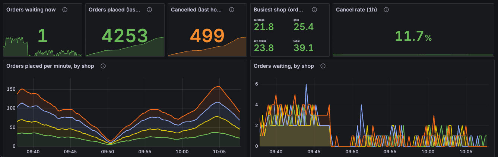
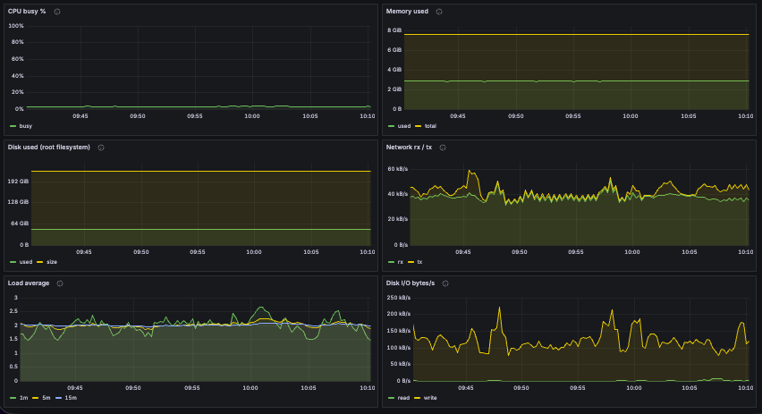
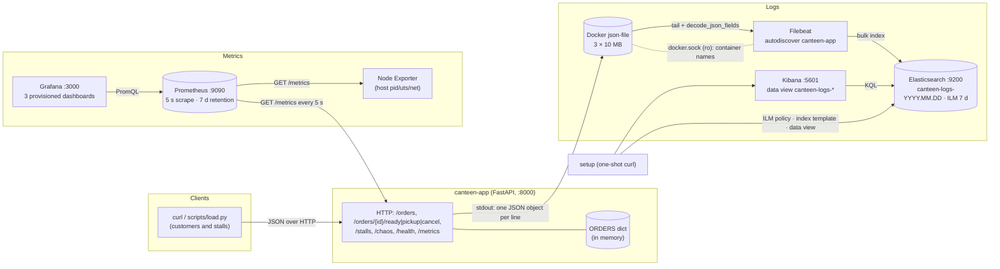
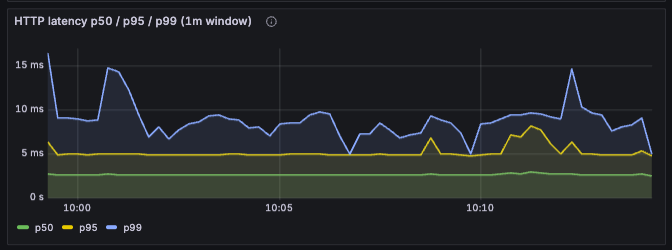

# canteen — Observability report

Enterprise Software Development, Fall 2026 — Assignment 1. Individual submission.

Code, compose stack, dashboards, scripts and raw results are in this directory. `README.md` explains how to run everything; `docs/architecture.md` has the full failure analysis; screenshots are in `docs/screenshots/` (`docs/screenshots/README.md` says what each one shows).

---

## A. Project

**Problem.** A university canteen has a few stalls and one crowd. Orders are shouted, nobody knows how long the biryani line really is, and when things go wrong (a stall runs out, the till is slow) the only signal is people complaining. I wanted the smallest possible app that has real business events to count and real requests to time, so that all the attention goes to observing it rather than building it.

**Users.** Students placing orders and stall staff marking them ready. There is no login: an order is identified by its id.

**Solution.** `canteen`: one FastAPI service with an in-memory dict. Four stalls (`chai`, `biryani`, `shawarma`, `juice`); an order moves `waiting → ready → picked_up`, or to `cancelled` from either of the first two. Six routes do that (`POST /orders`, `/ready`, `/pickup`, `/cancel`, `GET /orders/{id}`, `GET /stalls`), plus `/health`, `/metrics` and `/chaos`. Every transition records a metric and writes one JSON log line. Faults for Part E are switched on and off over HTTP (`POST /chaos`), copied from the way Lab 1 does it, so no restart is needed to reproduce or undo a problem.

**What works.** All of the above, checked by 11 tests that run the app in-process (lifecycle, illegal transitions, every metric, log format and privacy, both faults), and by the load generator (`scripts/load.py`: N customers ordering at random stalls, 10 % cancelling) that drove the experiments in E.

**How to try it.** `docker compose up -d --build`, wait for `docker compose ps` to show Elasticsearch and Kibana healthy, then http://localhost:8000/docs has a "Try it out" button on every route; `python3 scripts/load.py --duration 60` fills the dashboards; Grafana is at :3000 (admin/admin, folder **canteen**), Kibana at :5601 (data view **canteen logs**). `README.md` has the full start/use/test/clean-up steps.

---

## B. Metrics

### B.1 Metric table

All metrics are defined in `app/metrics.py` and only *recorded* in `app/main.py`, at the line where the business event happens. Every name has the `canteen_` prefix and base units. **Labels are bounded:** `stall` has 4 values, `route` is the route *template* (`/orders/{order_id}/ready`, never the real path), `status` is the HTTP status code, `method` the verb. Order ids and request ids are never labels; they are log fields (C). The per-stall series are pre-created so a stall with no orders shows 0 instead of "no data".

| Metric | Type | Labels | Unit | Kind | Purpose | Where / how recorded |
|---|---|---|---|---|---|---|
| `canteen_orders_placed_total` | Counter | stall | 1 | business | orders placed so far (20 → 21 when someone orders) | `place_order`: `.labels(stall).inc()` |
| `canteen_orders_cancelled_total` | Counter | stall | 1 | business | orders cancelled before pickup | `cancel`: `.inc()` |
| `canteen_orders_waiting` | Gauge | stall | 1 | business | orders placed but not yet ready: the queue at each stall; up on place, down on ready or cancel-while-waiting | `place_order` `.inc()`, `mark_ready`/`cancel` `.dec()` |
| `canteen_order_prep_seconds` | Histogram (buckets 0.5 s … 10 min) | stall | s | business | how long a stall takes: placed → ready; p95 per stall | `mark_ready`: `.observe(ready_at - placed_at)` |
| `canteen_order_prep_summary_seconds` | Summary | stall | s | business | the same quantity as a Summary: sum and count only, so its **mean** (Python summaries have no percentiles) | `mark_ready`: same `.observe()` |
| **`canteen_pickup_delay_seconds`** | Histogram (same buckets) | stall | s | business, **self-explored** | ready → picked up: how long food sits going cold at the counter; nothing in the HTTP metrics shows this | `pick_up`: `.observe(picked_up_at - ready_at)` |
| `canteen_http_requests_total` | Counter | method, route, status | 1 | application | request volume and failure share per route | `observe_http` middleware, after every response except `/metrics` |
| `canteen_http_request_duration_seconds` | Histogram (9 buckets 5 ms … 2.5 s) | method, route | s | application | latency per route; p50/p95/p99 | same middleware, `.observe(duration)` |
| `canteen_demo_requests_total` | Counter | `request_id` **only when** `CANTEEN_DEMO_CARDINALITY=1` | 1 | E.2 only | the cardinality experiment: one series per request | middleware, every request |

9 metric families: 4 Counters, 1 Gauge, 3 Histograms, 1 Summary (`curl -s localhost:8000/metrics | grep '^# TYPE canteen_'`); `tests/test_app.py::test_metrics_endpoint_has_all_four_types` asserts the four types.

### B.2 Dashboard: canteen / Application (`monitoring/grafana/dashboards/app.json`)

| Panel | Query | What the chart shows |
|---|---|---|
| Requests/s by status | `sum by (status) (rate(canteen_http_requests_total[1m]))` | traffic and failures per second: 2xx served, 409 illegal transition, 503 closed stall |
| Requests/s by route | `sum by (route) (rate(canteen_http_requests_total[1m]))` | which endpoints carry the load |
| HTTP latency p50 / p95 / p99 (1m) | `histogram_quantile(0.95, sum by (le) (rate(canteen_http_request_duration_seconds_bucket[1m])))` (and 0.5, 0.99) | the app answers in ~5 ms; under the slow-every-5th fault p95 jumps to the 0.5 s bucket while p50 stays flat |
| HTTP p95 by route (1m) | `histogram_quantile(0.95, sum by (le, route) (rate(…_bucket[1m])))` | the fault hits every route equally; a real slow dependency would move only some |
| Error rate (%) | `100 * sum(rate(canteen_http_requests_total{status=~"5.."}[5m])) / sum(rate(canteen_http_requests_total[5m]))` | 0 unless a stall is closed; slow requests do not show here |
| HTTP mean latency (1m) | `sum(rate(…_sum[1m])) / sum(rate(…_count[1m]))` | the average next to the percentiles |


### B.3 Dashboard: canteen / Business (`business.json`)

| Panel | Query | What the chart shows |
|---|---|---|
| Orders waiting now / placed (1h) / cancelled (1h) / busiest stall / cancel rate | `sum(canteen_orders_waiting)`, `sum(increase(canteen_orders_placed_total[1h]))`, `sum(increase(…cancelled_total[1h]))`, `topk(1, sum by (stall) (rate(…placed_total[5m])) * 60)`, cancelled ÷ placed | the live picture of the canteen |
| Orders placed per minute, by stall | `sum by (stall) (rate(canteen_orders_placed_total[5m])) * 60` | demand and its split |
| Orders waiting, by stall | `canteen_orders_waiting` | the gauge as-is; a stall whose line keeps rising is falling behind |
| Prep time p95 by stall (5m) | `histogram_quantile(0.95, sum by (le, stall) (rate(canteen_order_prep_seconds_bucket[5m])))` | how slow each stall is at its worst |
| Prep time mean by stall (Summary, 5m) | `sum by (stall) (rate(canteen_order_prep_summary_seconds_sum[5m])) / sum by (stall) (rate(…_count[5m]))` | the Summary's average, side by side with the histogram's p95 |
| Pickup delay p50 / p95 (5m) — self-explored | `histogram_quantile(0.95, sum by (le) (rate(canteen_pickup_delay_seconds_bucket[5m])))` | food going cold at the counter |
| Cancellations per minute, by stall | `sum by (stall) (rate(canteen_orders_cancelled_total[5m])) * 60` | lost business |



### B.4 p95 / p99 and the time window

`histogram_quantile(0.95, sum by (le) (rate(<metric>_bucket[W])))` estimates the 95th percentile from how the bucket counters grew during the last `W`. Two things decide `W`:

- **Enough observations.** With a 5 s scrape, `[1m]` spans 12 samples and `[5m]` 60. The HTTP histogram gets several observations per second under load, so `[1m]` is stable and reacts within a minute of a change; the latency panels use it. Each stall finishes only a few orders a minute, so the prep-time and pickup-delay panels use `[5m]`; with `[1m]` they jump between bucket edges.
- **The value is a bucket boundary, not a measurement.** The HTTP buckets are 5, 10, 25, 50, 100, 250, 500 ms, 1 s, 2.5 s. A p95 of "0.5 s" during the fault means "95 % of requests finished within the 0.5 s bucket"; the real delayed requests took 500 ms plus a few ms. The client-side numbers from `load.py` are the exact cross-check.

The Summary (`canteen_order_prep_summary_seconds`) has no percentiles in the Python client, so the dashboard shows its mean (`rate(_sum)/rate(_count)`) and the p95 comes from the histogram of the same quantity. The experiment stages are ≥ 120 s so every `[1m]` panel sits fully inside a stage and the `[5m]` panels can be seen ramping up and down.

### B.5 Self-explored metric: `canteen_pickup_delay_seconds`

The RED metrics describe the HTTP service. The thing a hungry student feels is different: the biryani was ready two minutes ago and is now cold, because the counter is crowded or nobody heard the number. That is the gap between `ready_at` and `picked_up_at`, which the app already knows. It costs one `observe()` in `pick_up`, and its p95 per stall is the only panel that would show "the counter is the bottleneck, not the kitchen". In the load generator the delay is a random 0.2–1 s walk, so the panel sits at ~1 s; in a real canteen it is the number I would put an alert on.

### B.6 Node Exporter

`prom/node-exporter:v1.9.1` runs with `pid`, `uts` and `network` set to `host` and is scraped as job `node`. **Machine measured:** `node_uname_info{nodename="docker-desktop", release="6.12.54-linuxkit", machine="aarch64"}` — the Docker Desktop Linux VM (8 vCPU, 8 GiB), not macOS itself. That is the honest machine to name: every container of this stack, the app included, runs inside that VM, so its CPU and memory are what the app can actually use. Host networking matters for the network panel: without it Node Exporter only sees its own container's virtual interface; with it `node_network_*` lists the VM's `eth0` and the Docker bridges, and the panel excludes `lo|veth.*|docker.*|br-.*`. A host-network container has no compose DNS name, so Prometheus reaches it via `extra_hosts: node-exporter:172.17.0.1` (the docker0 gateway). The **canteen / Node Exporter (machine)** dashboard shows the machine name, CPU busy %, memory used, root filesystem, network rx/tx, load average and disk I/O.



---

## C. Logs

### C.1 What is logged, why, where

`app/logging_config.py` configures structlog to write **one JSON object per line to stdout**. Every line has `ts` (UTC ISO-8601), `level`, `service` (`canteen`), `event` (machine name), `msg` (human sentence). Inside an HTTP request `request_id` is bound as a context variable (from the client's `X-Request-ID` header, else generated, echoed back in the response), so every line written while handling that request carries it.

| Event | Level | Extra fields | Emitted in | Why |
|---|---|---|---|---|
| `startup` / `shutdown` | info | stalls, demo_cardinality | lifespan | know the configuration behind a time range; restarts are visible |
| `http_request` | info (error if status ≥ 500) | method, path, route, status_code, duration_ms, request_id | middleware | one line per request, the log twin of the RED metrics (`/metrics` and `/health` are skipped: 18 identical lines a minute) |
| `order_placed` | info | order_id, stall, queue_length, request_id | `place_order` | start of an order's trace, and how long the line was |
| `order_ready` | info (warning if prep > 5 min) | order_id, stall, prep_s | `mark_ready` | the per-order detail behind the prep histogram |
| `order_picked_up` | info | order_id, stall, pickup_delay_s | `pick_up` | end of the trace; food-going-cold detail |
| `order_cancelled` | warning | order_id, stall, was_ready | `cancel` | lost business, and whether the food was already cooked (waste) |
| `chaos_changed` | warning | slow_every_n, delay_ms, fail_stall | `/chaos` routes | what fault was active when (brackets every experiment stage) |
| `error` | error | exc_type, exc_message, exception | middleware | anything unhandled, with the traceback |

uvicorn's own loggers go through the same JSON formatter; they are kept at WARNING so their per-connection chatter does not reach the index.

**What is deliberately not logged:** the `item` text. It is free text a customer typed and could contain a name or a phone number, so `drop_forbidden_keys` removes `item` (and `authorization`, `cookie`, `token`, `password`) before rendering; `test_every_log_line_is_json_with_required_fields` asserts a marker string in `item` never reaches a log line. Order events carry `order_id` and `stall`, which is all the trace needs.

### C.2 How Filebeat collects and parses

Docker's `json-file` driver writes each stdout line as `{"log":"<our JSON>\n","stream":"stdout","time":"…"}` into `/var/lib/docker/containers/<id>/<id>-json.log` (3 files × 10 MB, set in the compose `logging` block). Filebeat (`monitoring/filebeat/filebeat.yml`) runs with that directory and the Docker socket mounted read-only:

1. **autodiscover (docker provider)** — a template whose condition is `equals: docker.container.name: canteen-app` starts a `filestream` input on that one container's log file. Prometheus/Grafana/ES/Kibana output never enters the index, and a re-created app (new container id) is followed automatically.
2. **container parser** (`format: docker`) unwraps the Docker envelope into `message`.
3. **`decode_json_fields`** (`fields: [message]`, `target: ""`, `overwrite_keys: true`) parses our JSON so `event`, `order_id`, `prep_s`, … become top-level, searchable fields.
4. **`timestamp`** copies our `ts` into `@timestamp`, so Kibana orders lines by when the app wrote them, not when Filebeat read them.
5. **`drop_fields`** removes Beat/Docker noise; `add_docker_metadata` keeps `container.name` / `container.id`.
6. Output: index `canteen-logs-%{+yyyy.MM.dd}`. Filebeat's own template/ILM setup is disabled; the one-shot `setup` compose service (`scripts/setup_elastic.sh`) installs `monitoring/elasticsearch/index_template.json` (keyword for `event`, `order_id`, `stall`, `request_id`; numbers for `duration_ms`, `prep_s`, `pickup_delay_s`, `status_code`) and the ILM policy *before* Filebeat starts. This avoids Filebeat's ECS template, which maps `event` as an object and would reject our string.

No text parsing is needed anywhere: the app writes JSON, Filebeat decodes JSON.

### C.3 Where logs live, what survives, when they are deleted

| Stage | Where | Survives app restart | Survives `docker compose down` | Deleted |
|---|---|---|---|---|
| raw stdout | `/var/lib/docker/containers/<app-id>/*-json.log` (inside the Docker VM) | yes (until the container is re-created) | no | rotation at 3 × 10 MB; container removal |
| Filebeat offsets | volume `filebeat_registry` | yes | yes (not `down -v`) | — |
| indexed documents | volume `es_data`, one index per day `canteen-logs-YYYY.MM.DD` | yes | yes (not `down -v`) | ILM `canteen-logs-policy`: hot phase, **delete 7 days after index creation** |

If Filebeat is down, nothing is lost up to 30 MB of app output: it resumes from the registry offset. If Elasticsearch is down, Filebeat retries with backoff. If the app container is removed, its raw log file is gone but everything already shipped stays in ES.

### C.4 One log line, its stored fields, a working search

Original line as the app wrote it (`docker logs canteen-app | grep order_ready | head -1`):

```json
{"msg": "order ready after 1.2 s", "order_id": "ffd671df", "stall": "biryani", "prep_s": 1.18, "event": "order_ready", "request_id": "fa18b3fe535a", "level": "info", "service": "canteen", "ts": "2026-09-17T07:41:25.174736Z"}
```

Stored document (`curl 'localhost:9200/canteen-logs-*/_search?q=order_id:ffd671df&size=1'`, abridged):

```json
{"@timestamp": "2026-09-17T07:41:25.174Z", "ts": "2026-09-17T07:41:25.174736Z", "service": "canteen", "level": "info",
 "event": "order_ready", "msg": "order ready after 1.2 s", "order_id": "ffd671df", "stall": "biryani", "prep_s": 1.18,
 "request_id": "fa18b3fe535a", "stream": "stdout", "container": {"id": "7153270af60b…", "name": "canteen-app"},
 "message": "{\"msg\": \"order ready after 1.2 s\", \"order_id\": \"ffd671df\", … }\n"}
```

`message` is the untouched original; every other field was extracted by `decode_json_fields`; `@timestamp` came from `ts`; `container.*` from `add_docker_metadata`. The mapping (`_mapping`) shows `event: keyword`, `order_id: keyword`, `prep_s: float`, `duration_ms: float`, `status_code: integer`, so range queries work.

Working searches (Kibana → Discover → **canteen logs**; the full list is in `scripts/kibana_queries.md`):

- Follow one order: `order_id : "ffd671df"` → `order_placed` → `order_ready` → `order_picked_up`, each with the `request_id` of the HTTP call that caused it.
- Find an error: `level : "error"`; slow requests: `event : "http_request" and duration_ms > 400`; failed orders: `event : "http_request" and status_code >= 500`.
- Shell equivalent: `curl --get 'localhost:9200/canteen-logs-*/_count' --data-urlencode 'q=event:"http_request" AND duration_ms:>400'`.


---

## D. System design

### D.1 Architecture



Solid arrows are the runtime data paths, dotted ones metadata and one-shot jobs. `docs/architecture.md` has the same diagram with the per-component table (role, who it talks to, what state it holds) and the data-location table. The choices, in short:

- **One process, no database.** The point is observing, not persisting; an in-memory dict keeps the app at 200 lines and makes "what happens on restart" a one-line answer (orders are gone, the `startup` log line and the counter reset show it).
- **Metrics are pulled, logs are pushed.** Prometheus scrapes `/metrics` every 5 s (7-day TSDB): a missing target is visible as DOWN. Filebeat tails Docker's json-file and pushes to Elasticsearch (daily indices, 7-day ILM): the app never knows where its stdout goes. Both keep their data in named volumes across `docker compose down`.
- **Metrics are aggregated, logs are specific.** `stall`, `route` and `status` are the only labels; `order_id` and `request_id` live in Elasticsearch where one keyword lookup finds them. Each tool gets the shape of data it is good at.
- **Setup is a compose job**, so the mapping and the data view exist before the first line is shipped.
- **Chaos over HTTP**, copied from Lab 1: a fault is one request to switch on and one to switch off, and the `chaos_changed` log line brackets every experiment stage.

**What happens if a component stops** (users vs observability, and how it recovers):

| Failure | Effect on users | Effect on observability | Recovery |
|---|---|---|---|
| **canteen-app crashes** | every order is forgotten (in-memory); requests fail until it is back | Prometheus target DOWN (`up == 0`), counters restart from 0 (`rate()` copes with resets); a `startup` line in Kibana marks the restart | `docker compose up -d app` |
| **Prometheus down** | none | Grafana panels empty; the samples for the outage are lost forever (pull model, nothing buffers them) | restart; history before the outage is in `prom_data` |
| **Grafana down** | none | no dashboards; Prometheus still answers at :9090 | restart; dashboards re-provision from files |
| **Node Exporter down** | none | machine panels empty, target DOWN | restart |
| **Filebeat down** | none | logs stop appearing in Kibana but are **not lost**: Docker keeps the last 30 MB per container and Filebeat resumes from its registry offset | restart; catch-up is automatic |
| **Elasticsearch down** | none | Filebeat retries with backoff (in-memory queue), Kibana shows "unavailable" | restart ES, wait for healthy |
| **Kibana down** | none | no UI; `curl :9200/canteen-logs-*/_search` still works | restart |
| **setup job fails** | none | new indices get Elasticsearch's dynamic mapping (`event` would still be a keyword, numbers guessed) and no ILM, and Kibana has no data view | `docker compose up setup` |


### D.2 Follow a metric: `canteen_orders_placed_total{stall="biryani"}`

1. **Code updates it.** `app/main.py` `place_order()`: after the order is stored, `metrics.ORDERS_PLACED.labels(stall=order.stall).inc()`. The Counter object is created once in `app/metrics.py` (`Counter("canteen_orders_placed_total", …, ["stall"])`) and its four stall series are pre-created at import so each exists from startup at 0.
2. **Exposed.** `GET /metrics` calls `generate_latest(REGISTRY)`; the text contains e.g. `canteen_orders_placed_total{stall="biryani"} 57.0` (`curl -s localhost:8000/metrics | grep orders_placed`).
3. **Prometheus collects and stores it.** `monitoring/prometheus/prometheus.yml`, job `canteen`, target `app:8000`, `scrape_interval: 5s`. Each scrape appends one sample `(timestamp, 57)` to the series identified by the full label set `{__name__="canteen_orders_placed_total", stall="biryani", instance="app:8000", job="canteen"}`, kept 7 days in `prom_data`. Query: `curl 'localhost:9090/api/v1/query?query=canteen_orders_placed_total{stall="biryani"}'` → `57`. When the app restarts the raw value drops to 0; `rate()` and `increase()` detect the reset and keep counting.
4. **Grafana queries and displays it.** Datasource uid `prometheus` (provisioned from `monitoring/grafana/provisioning/datasources/prometheus.yml`). Business dashboard, panel "Orders placed per minute, by stall": `sum by (stall) (rate(canteen_orders_placed_total[5m])) * 60`; the stat "Orders placed (last hour)" runs `sum(increase(canteen_orders_placed_total[1h]))` for the absolute number.


### D.3 Follow a log: one `order_ready` line

1. **Code writes it.** `mark_ready()`: `log.info("order_ready", msg=…, order_id=…, stall=…, prep_s=…)`. structlog processors merge the bound `request_id`, add `level`, `service`, `ts`, drop forbidden keys, render JSON, print to stdout.
2. **Docker saves it.** json-file driver → `/var/lib/docker/containers/<id>/<id>-json.log`, wrapped as `{"log":"…","stream":"stdout","time":"…"}`.
3. **Filebeat collects and parses it.** autodiscover matches `canteen-app`; the container parser unwraps; `decode_json_fields` → top-level fields; `timestamp` → `@timestamp`; bulk-indexed into `canteen-logs-2026.09.17`.
4. **Elasticsearch stores it** with the mapping from the index template (`event`, `stall`, `order_id` keyword; `prep_s` float), ILM policy attached.
5. **Kibana finds it.** Discover, data view `canteen-logs-*`, `event : "order_ready" and stall : "biryani" and prep_s > 2`. Format changes along the way: our JSON → Docker envelope → flat ES document with `message` (the original) plus the extracted fields and `@timestamp`. The exact line and document are in C.4.

### D.4 Things I do not fully understand yet / known limits

- **In-memory state and horizontal scale.** Two app replicas would each have their own `ORDERS` and their own counters; Prometheus would label them by `instance` and `sum by (stall)` would still be right, but an order placed on one replica could not be marked ready on the other. A real version needs a database, and then the interesting metrics move there.
- **Prometheus staleness.** After the `request_id` label is removed in E.2, `count(canteen_demo_requests_total)` drops to 1 within a scrape because Prometheus writes staleness markers for series that disappeared, yet `last_over_time(…[15m])` still sees the old series. I understand the observed behaviour, not the exact rules of when a series leaves the head block.
- **Filebeat's in-memory queue.** I know it retries and resumes from the registry when Elasticsearch comes back, but not the exact size after which events are dropped without a Filebeat restart.
- **Node Exporter on Docker Desktop** measures the VM, and the VM's `eth0` traffic includes Docker Desktop's own traffic to the Mac; I have not separated the two.
- **The slow fault is a sleep in the middleware**, so it costs no CPU; a real slow dependency would also show in the Node dashboard. The `closed` fault (`fail_stall`) is the failure-shaped alternative and is wired and tested, but only the slow one was run as the E.1 experiment.

---

## E. Experiments

### E.1 Reproduce a problem — a slow till: every 5th request takes 500 ms longer

**Setup.** `scripts/experiment_fault.sh slow` runs three stages of ≥ 120 s (24 scrapes at 5 s), each with the same load: 4 concurrent customers from `scripts/load.py` placing orders at random stalls, marking them ready after 0.5–3 s, picking up after 0.2–1 s, 10 % cancelling. Between stages the fault is toggled over HTTP: `POST /chaos {"slow_every_n": 5, "delay_ms": 500}` (the assignment's example fault) and `POST /chaos/reset`. Every `/orders*` request whose sequence number is a multiple of 5 sleeps 500 ms inside the request handler. A `chaos_changed` log line marks each toggle. The predictions below were written before the run (`scripts/results/predictions_slow.md`, committed before the results); the numbers come from `scripts/stage_counts.py` (Prometheus evaluated over each stage window, Elasticsearch counts with the same time filter) and from `load.py`'s client-side timings.

| # | Prediction | Result |
|---|---|---|
| P1 | HTTP p95 rises from ~10 ms to ~0.5 s (a bucket edge, 0.5 or 1 s); p50 stays at a few ms because only 20 % of requests are delayed; p99 similar to p95 | **Confirmed.** server-side p50 / p95 / p99: 0.003 / 0.005 / 0.005 s → **0.003 / 0.873 / 0.975 s** → 0.003 / 0.005 / 0.005 s. Client-side p95 per route: ~10 ms → **510–515 ms** → ~10 ms. The 0.873 is `histogram_quantile` interpolating inside the (0.5 s, 1 s] bucket: a delayed request takes 500 ms of sleep plus ~8 ms of work = 508 ms, just *over* the 0.5 s edge (see B.4). |
| P2 | HTTP mean rises by ≈ 0.2 × 0.5 s = 100 ms | **Confirmed.** mean 0.002 → **0.101** → 0.002 s. |
| P3 | Fewer requests per stage (10–20 %), no change in the status mix, no 5xx | **Confirmed.** requests per stage 654 → **584** → 662 (−11 %); orders 224 → 200 → 221; 5xx = 0, `level:"error"` = 0 in every stage; cancel share unchanged (~9.5 %). |
| P4 | Business metrics barely move: waiting gauge, prep p95 and pickup-delay p95 are dominated by the customer sleeps, not by 0.5 s of server delay | **Half wrong.** waiting gauge (avg) 2.7 / 2.8 / 3.0 and prep p95 4.63 / 4.66 / 4.63 s did not move, but **pickup delay p95 went 0.96 → 1.59 → 0.97 s**. Reason: `pickup_delay = picked_up_at − ready_at` is stamped *inside* the handlers, so a `pickup` request that hits the 500 ms sleep records 500 ms more delay. The self-explored metric picked up the fault through a side door I had not thought of. |
| P5 | Kibana `event:"http_request" and duration_ms > 400` matches ~20 % of `http_request` documents during the fault and 0 outside it; `level:"error"` 0; `chaos_changed` lines bracket the fault stage | **Confirmed.** `duration_ms > 400`: 0 / **115** / 0 documents (115 of 571 = 20.1 %); errors 0; `chaos_changed` 1 in the baseline window (the reset that starts it), 1 in the fault window (the set); the recovery reset lands in the 10 s pause before the recovery window, so 0 there. |
| P6 | Recovery: `[1m]` latency panels back to baseline within a minute of the reset; stage numbers back to baseline | **Confirmed.** recovery stage equals baseline within noise on every row (table below); the p95 panel drops within one minute of the reset. |
| P7 | Node Exporter: no CPU change (a sleep costs nothing) | **Confirmed.** machine CPU busy 3.0 / 3.0 / 2.9 %. |

Stage windows (UTC) and per-stage numbers (`scripts/results/stage_counts_slow_run2.txt`; Prometheus counts are `increase()` over the window and therefore fractional, rounded here; Elasticsearch counts are exact):

| Stage | UTC window | orders | HTTP requests | server p50 / p95 / p99 (s) | server mean (s) | client p95 POST /orders (ms) | 5xx | pickup delay p95 (s) | docs `duration_ms > 400` |
|---|---|---|---|---|---|---|---|---|---|
| baseline (reset) | 07:52:09 → 07:54:12 | 222 | 654 | 0.003 / 0.005 / 0.005 | 0.002 | 9.7 | 0 | 0.96 | 0 |
| fault (slow_every_n=5) | 07:54:22 → 07:56:25 | 196 | 584 | 0.003 / **0.873** / **0.975** | **0.101** | **512.8** | 0 | **1.59** | **115** |
| recovery (reset) | 07:56:35 → 07:58:38 | 222 | 662 | 0.003 / 0.005 / 0.005 | 0.002 | 9.7 | 0 | 0.97 | 0 |

Raw: `scripts/results/fault_slow_20260917T075159Z.txt` (+ `.stages`), `load_2026-09-17T0752*_slow_*.json` … `0756*`, `experiments_console_slow_run2.txt`.

**Cause and effect on users.** Every fifth call to the till takes half a second longer. Nobody sees an error and the median customer notices nothing, which is exactly why a p95 panel exists: the mean moved by 100 ms, the p95 by 500 ms, and the error rate not at all. The one business effect was food sitting a little longer at the counter, because the pickup call itself was sometimes the slow one.

**The first run, kept on purpose.** `fault_slow_20260917T074243Z.txt` and `stage_counts_slow.txt` are the first attempt: the client saw p95 = 511 ms, but the server-side histogram and `duration_ms` stayed at 5 ms and Kibana found 0 slow requests. The sleep was placed *before* `start = time.perf_counter()` in the middleware, so the app measured everything except the fault. The metrics were right and my fault was wrong; the fix is one moved line (commit `cc67355`) and the run above is the repeat.




### E.2 Cardinality explosion (capped at 100)

`scripts/experiment_cardinality.py`: re-create the app with `CANTEEN_DEMO_CARDINALITY=1` so `canteen_demo_requests_total` gains a `request_id` label; send 100 × `GET /stalls`, each with its own `X-Request-ID`; wait two scrapes; re-create with the flag off; send 20 more; wait; compare. Only ids a client chose become label values (generated ones for health checks never do, see below), so the experiment stops at exactly 100.

| Snapshot (`scripts/results/cardinality_20260917T075955Z.json`) | `count(canteen_demo_requests_total)` | `count(last_over_time(…[15m]))` | series API (30 m) | `prometheus_tsdb_head_series` | `count({__name__=~"canteen_.*"})` |
|---|---|---|---|---|---|
| before, flag off | 1 | 114 | 114 | 3,235 | 229 |
| flag on, idle | 0 (a labelled counter has no series until the first id arrives) | 114 | 114 | 3,273 | 25 |
| flag on, after 100 requests | **100** | 114 | 114 | 3,273 | 138 |
| flag off, after 20 requests | 1 | 114 | 114 | 3,311 | 39 |

**Reading.** 100 requests → 100 series for one counter. After the label is removed, `count()` drops to 1 on the next scrape because Prometheus writes a staleness marker for every series that vanished from the target; but the old series are still on disk and still answer range queries (`last_over_time`, the series API) until the 7-day retention deletes them — removing a label does not delete history. The 114 (not 101) in the history column is the first attempt: that run also labelled the app's *generated* ids (the Docker healthcheck hits `/health` every 10 s), so it passed 100 and reached 113 live series before I noticed; `cardinality_20260917T075103Z.json` keeps it. The fix was to label only client-supplied ids, and because the second run reused the same 100 id strings (`card-000` … `card-099`) it created no new history. `count({__name__=~"canteen_.*"})` drops after every restart (25, 39) and climbs as HTTP method × route × status combinations reappear: every bucket, `_sum` and `_count` of every histogram is its own series.

**At scale.** Cardinality is multiplicative: `series = metrics × Π(distinct label values)`. This app's bounded labels give 130–230 `canteen_` series. One `order_id` label on the HTTP counter alone would add a series per order per route per status: at 1,000 orders a day that is thousands of new series every day that never stop being scraped as long as the process lives, each costing head memory, WAL and index space, and slowing every `rate()` over the metric. That is why ids live in logs: Elasticsearch indexes `order_id` as a keyword and a search for one id costs one lookup, not one time series per id.


---

## Credits

- **Course material.** Enterprise Software Development (Habib University), Fall 2026, Assignment 1. Lab 1 (Midnight Launch) is the model for the stack's shape (FastAPI + `prometheus_client`, JSON logs to stdout, Filebeat autodiscover, provisioned Grafana) and for toggling faults over HTTP instead of restarts. The assignment brief's food-ordering example is where the app and its counter/gauge/histogram/summary come from.
- **Reused configuration.** The Filebeat, Elasticsearch index template/ILM, setup job and Node Exporter host-network configuration are copied from my earlier `termlab` project for this assignment and trimmed. The Node dashboard is a hand-written subset of Grafana community dashboard 1860 (*Node Exporter Full*, rfmoz).
- **Libraries and images.** FastAPI, uvicorn, pydantic, prometheus_client, structlog, pytest, uv; Prometheus, Grafana, Node Exporter, Elasticsearch, Kibana, Filebeat and curl images pinned in `docker-compose.yml`.
- **Documentation consulted.** Prometheus docs (histograms and summaries, label naming, staleness), prometheus_client docs, Filebeat autodiscover and processor docs, Elasticsearch ILM and index-template docs, Docker json-file logging driver docs.
- **AI assistance.** Claude (Anthropic, via Claude Code) drafted the code, configuration, dashboards and this report from my design and the plan we agreed, ran the experiments, and found the two bugs described in E (delay outside the timer; healthcheck ids labelled). I have read and can explain every file; the design, the choice of app and the interpretation of the results are mine.

## Appendix: compose services

| Service | Image | Role |
|---|---|---|
| `app` | built from `app/Dockerfile` (python:3.12-slim) | the canteen, `/metrics`, JSON logs, `/chaos` |
| `prometheus` | prom/prometheus:v3.5.0 | 5 s scrape, 7 d retention |
| `grafana` | grafana/grafana:12.1.0 | provisioned datasource + 3 dashboards |
| `node-exporter` | prom/node-exporter:v1.9.1 | machine metrics (`docker-desktop`), host network |
| `elasticsearch` | elasticsearch:8.18.0 | single node, security off, 768 MB heap |
| `kibana` | kibana:8.18.0 | Discover |
| `filebeat` | filebeat:8.18.0 | autodiscover `canteen-app` → ES |
| `setup` | curlimages/curl:8.14.1 | one-shot: ILM policy, index template, data view |
