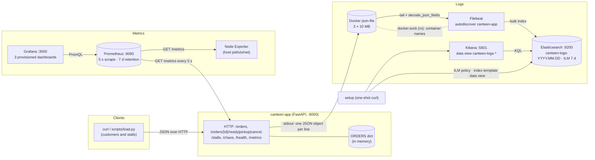

# canteen architecture

## Components

| Component | What it does | Talks to | State it holds |
|---|---|---|---|
| **canteen-app** | the order queue: 4 stalls, orders `waiting → ready → picked_up` or `cancelled`; records 9 metrics on the way and writes one JSON log line per event; chaos endpoints for Part E | nothing (no database) | `ORDERS` dict in memory — lost on restart, by design |
| **Prometheus** | pulls `app:8000/metrics`, `node-exporter:9100` and itself every 5 s; stores samples 7 days | app, node-exporter | `prom_data` volume (TSDB) |
| **Grafana** | three dashboards provisioned from files (Application, Business, Node); datasource uid `prometheus` | Prometheus | `grafana_data` volume (users/prefs only) |
| **Node Exporter** | CPU, memory, disk, network of the kernel it runs on; on Docker Desktop that is the `docker-desktop` VM where every container runs | – | – |
| **Filebeat** | Docker autodiscover: tails only the container named `canteen-app`; `decode_json_fields` turns the line into fields; `@timestamp` := our `ts` | Docker socket (names), `/var/lib/docker/containers` (log files), Elasticsearch | `filebeat_registry` volume (read offsets: a restart does not re-ship) |
| **Elasticsearch** | stores `canteen-logs-YYYY.MM.DD` with the mapping from `monitoring/elasticsearch/index_template.json`; ILM deletes an index 7 days after creation | – | `es_data` volume |
| **Kibana** | Discover on the `canteen-logs-*` data view | Elasticsearch | its saved objects live in ES |
| **setup** | one-shot `curl` job: PUT ILM policy, PUT index template, POST data view; Filebeat waits for it | ES, Kibana | none (idempotent) |

## Why this shape

- **Metrics are pulled, logs are pushed.** Prometheus scrapes because that is how it works (targets are discovered, missing targets are visible as DOWN); logs are pushed by Filebeat because the app should never know or care where its stdout ends up.
- **Metrics stay low-cardinality; identities go to logs.** `stall` (4 values), `route` (a template) and `status` are the only labels. `order_id` and `request_id` are fields in Elasticsearch, where one keyword lookup finds them, never Prometheus labels, where each value would be a new time series. `canteen_demo_requests_total` breaks this rule on purpose for Part E.2.
- **JSON from the first byte.** The app writes JSON; Docker wraps it; Filebeat unwraps and decodes it. No grok, no dissect, no regexes anywhere.
- **Setup is a compose job**, not a README step, so the first log line already lands with the right mapping and the data view exists before anyone opens Kibana.
- **Chaos over HTTP.** Faults are toggled with a request, so an experiment stage is `curl`, `load.py`, `curl`, and undoing the fault is one more request.

## What happens if a component stops

| Failure | Effect on users | Effect on observability | Recovery |
|---|---|---|---|
| **canteen-app crashes** | every order is forgotten (in-memory); requests fail until it is back | Prometheus target DOWN (`up == 0`), counters restart from 0 (`rate()` copes with resets); a `startup` line in Kibana marks the restart | `docker compose up -d app` |
| **Prometheus down** | none | Grafana panels empty; the samples for the outage are lost forever (pull model, nothing buffers them) | restart; history before the outage is in `prom_data` |
| **Grafana down** | none | no dashboards; Prometheus still answers at :9090 | restart; dashboards re-provision from files |
| **Node Exporter down** | none | machine panels empty, target DOWN | restart |
| **Filebeat down** | none | logs stop appearing in Kibana but are **not lost**: Docker keeps the last 30 MB per container and Filebeat resumes from its registry offset | restart; catch-up is automatic |
| **Elasticsearch down** | none | Filebeat retries with backoff (in-memory queue), Kibana shows "unavailable" | restart ES, wait for healthy |
| **Kibana down** | none | no UI; `curl :9200/canteen-logs-*/_search` still works | restart |
| **setup job fails** | none | new indices get Elasticsearch's dynamic mapping (`event` would still be a keyword, numbers guessed) and no ILM, and Kibana has no data view | `docker compose up setup` |

## Where data lives and when it is deleted

| Data | Location | Survives `docker compose down`? | Survives `down -v` / `cleanup.sh`? | Deleted when |
|---|---|---|---|---|
| orders | app memory | no | no | app restart |
| app stdout (raw JSON logs) | `/var/lib/docker/containers/<id>/<id>-json.log` in the VM | no (container removed) | no | rotated at 3 × 10 MB; removed with the container |
| Filebeat read offsets | volume `filebeat_registry` | yes | no | – |
| indexed logs | volume `es_data`, indices `canteen-logs-YYYY.MM.DD` | yes | no | ILM `canteen-logs-policy` deletes an index 7 days after creation |
| metrics | volume `prom_data` | yes | no | Prometheus retention 7 d |
| Grafana prefs/users | volume `grafana_data` | yes | no | – (dashboards are files in the repo) |
