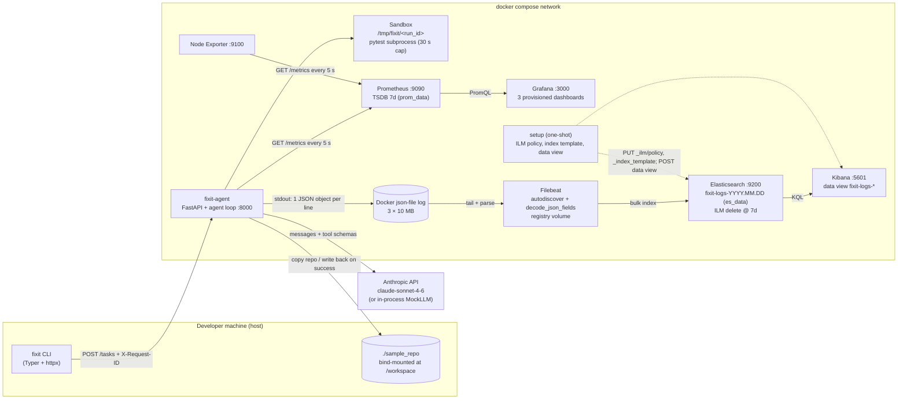

# fixit — Observability report

Enterprise Software Development, Fall 2026 — Assignment 1. Author: Hassan (Talha Moosani).
Code: `ESD/fixit/` in this repository. Everything below was produced by running the stack on the machine described in B.5.

---

## A. Project

**Problem.** Developers spend a lot of time on mechanical fixes: a test fails, you read the code, patch it, rerun the tests, repeat. LLM "coding agents" can do this loop, but they are usually black boxes: you don't know how long a fix took, how many attempts it needed, what it cost, or why it failed.

**Users.** A single developer on their laptop who wants to hand a small task to an agent and get a fixed repo back, *and* wants to see what happened (latency, cost, iterations, failures) rather than trust it blindly.

**Solution.** `fixit` is a local agentic coding tool split into two parts:

- `fixit-agent`, a FastAPI server in Docker. `POST /tasks {task, repo}` runs a bounded loop: the LLM picks one of three tools (`read_file`, `write_file`, `run_tests`), the server executes it in an isolated temp copy of the repo (pytest with a 30 s timeout), feeds the result back, and stops when the LLM stops calling tools (max 10 iterations). On success the changed files are copied back to the mounted repo.
- `fixit`, a Typer CLI: `fixit run "make the failing tests pass" --repo ./sample_repo`, `fixit status <run_id>`, `fixit history`, `fixit health`.

The LLM is pluggable: `AnthropicLLM` (Claude `claude-sonnet-4-6` via the Messages API with tool use) or `MockLLM`, a scripted, deterministic agent that fixes the sample repo in exactly 5 calls with 0.2 s of simulated latency each. All experiments use the mock so they are free and repeatable. A `FaultInjectingLLM` wrapper (env `FIXIT_FAULT=none|slow|flaky`) is the switch for Part E.

**What works.** The whole stack starts from `docker compose up -d` with no API key. The agent fixes `sample_repo` (calculator with a swapped-argument bug and an off-by-one bug; 2 of 5 tests failing) in 5 iterations, ~2 s, $0.0375 of (simulated) tokens. 27 unit/integration tests pass. Metrics reach Grafana, logs reach Kibana, both experiments run end-to-end from scripts.

**How to try it.** See `README.md`: `cp .env.example .env && docker compose up -d && uv sync && uv run fixit run "make the failing tests pass" --repo ./sample_repo`.

---

## B. Metrics

### B.1 Metric table

All definitions live in `agent/metrics.py` (nothing else defines metrics). Names carry the `fixit_` prefix and base units (seconds). Labels are deliberately low-cardinality: `run_id`, file paths and task text are **never** labels (see E.2).

| Metric | Type | Unit | Labels | Purpose | Where recorded (how) |
|---|---|---|---|---|---|
| `fixit_http_requests_total` | Counter | 1 | `method`, `path`, `status` | Application: request volume and failure rate | `main.py` `observe_http` middleware: `.labels(method, route_template(path), status).inc()` after every response (`/metrics` excluded) |
| `fixit_http_request_duration_seconds` | Histogram | s | `method`, `path` | Application: API response time, p95/p99 | same middleware: `.observe(perf_counter() - start)` |
| `fixit_llm_requests_total` | Counter | 1 | `provider`, `status` (`ok`/`error`/`retry`) | Application: LLM calls and failures | `llm.py` `complete_with_retry`: `ok` on success, `error` on each raised attempt, `retry` before each back-off |
| `fixit_llm_request_duration_seconds` | Histogram | s | `provider` | Application: LLM latency p95/p99 — where the slow fault shows | `llm.py` `complete_with_retry`: observed per attempt |
| `fixit_tool_calls_total` | Counter | 1 | `tool`, `status` | Application/business: which tools the agent uses | `loop.py` after `tools.dispatch()` |
| `fixit_tool_exec_seconds` | **Summary** | s | `tool` | Application: average tool execution time (Python summaries have no quantiles; the histograms above give percentiles) | `tools.py` `Toolbox.dispatch`: `.observe(duration)` |
| `fixit_tasks_total` | Counter | 1 | `outcome` | Business: tasks by success/failed/aborted/error | `loop.py` end of `run_task` |
| `fixit_tasks_in_progress` | Gauge | 1 | — | Business: concurrent agent runs | `loop.py`: `.inc()` at start, `.dec()` in `finally` |
| `fixit_task_duration_seconds` | Histogram | s | `outcome` | Business: end-to-end time to fix | `loop.py` end of `run_task` |
| `fixit_task_iterations` | Histogram | 1 | `outcome` | Business (self-explored): loop iterations per task — shows thrashing | `loop.py`, buckets 1,2,3,5,8,10 |
| `fixit_llm_tokens_total` | Counter | 1 | `direction` (`input`/`output`) | Business: token consumption | `llm.py` after each successful call |
| `fixit_llm_cost_usd_total` | Counter | USD | `provider` | Business: spend (price table in `llm.py`, $3/$15 per MTok for claude-sonnet-4-6; mock uses the same table) | `llm.py` after each successful call |
| `fixit_sandbox_test_runs_total` | Counter | 1 | `result` (`passed`/`failed`/`timeout`) | Business: test outcomes | `sandbox.py` `run_pytest` |
| `fixit_build_info` | Gauge | 1 | `version`, `llm_backend`, `fault_mode` | Shows current config in Grafana (always 1) | `main.py` at import: `set_build_info(...)` |

Histogram buckets: HTTP + LLM latency `0.05, 0.1, 0.25, 0.5, 1, 2.5, 5, 10, 30`; task duration `1, 2, 5, 10, 20, 30, 60, 120`; iterations `1, 2, 3, 5, 8, 10`. All four metric types are used: Counter (7), Gauge (2), Histogram (4), Summary (1).

The Python client also emits a `*_created` gauge next to every counter/histogram by default; I disabled that in the image (`PROMETHEUS_DISABLE_CREATED_SERIES=True`) because it doubles the series count for nothing.

Prometheus scrapes `agent:8000`, `node-exporter:9100` and itself every **5 s** (`monitoring/prometheus/prometheus.yml`), retention 7 days (`--storage.tsdb.retention.time=7d`).

### B.2 Dashboard: fixit / Application (`monitoring/grafana/dashboards/fixit_app.json`)

`[SCREENSHOT: grafana_app_dashboard]`

| Panel | Query | What it shows |
|---|---|---|
| Requests/s by HTTP status | `sum by (status) (rate(fixit_http_requests_total[1m]))` | Request rate split by status code; 5xx lines are failed requests. Under load ≈ 0.5 req/s of `200` (one `POST /tasks` every 2 s) plus health checks. |
| HTTP p95 latency (5m) | `histogram_quantile(0.95, sum by (le) (rate(fixit_http_request_duration_seconds_bucket[5m])))` | 95th-percentile response time. `POST /tasks` is synchronous and *is* the whole agent run, so this tracks task duration (~2 s baseline). |
| LLM latency p95 / p99 (5m) | `histogram_quantile(0.95, sum by (le) (rate(fixit_llm_request_duration_seconds_bucket[5m])))` and the same with `0.99` | Per-attempt LLM call latency. Mock ≈ 0.2 s. This is where the `slow` fault shows: every 5th call takes 3.2 s, so p95 (and p99) jump into the 2.5–5 s bucket. |
| LLM error rate (5m) | `(sum(rate(fixit_llm_requests_total{status="error"}[5m])) or vector(0)) / sum(rate(fixit_llm_requests_total[5m]))` | Fraction of LLM attempts that raised. `or vector(0)` makes the panel show 0 instead of "no data" when there have been no errors. |
| Avg tool execution time by tool | `rate(fixit_tool_exec_seconds_sum[5m]) / rate(fixit_tool_exec_seconds_count[5m])` | Mean tool time from the **Summary**'s `_sum/_count`. `run_tests` (a pytest subprocess, ~0.4 s) dominates; `read_file`/`write_file` are ~0 ms. |
| Tool call mix (1h) | `sum by (tool) (increase(fixit_tool_calls_total[1h]))` | Donut of which tools the agent used: 50 % `run_tests`, 25 % `read_file`, 25 % `write_file` for the mock. |
| LLM calls/s by status | `sum by (status) (rate(fixit_llm_requests_total[1m]))` | `ok`/`error`/`retry` attempt rates; `retry` is non-zero only in flaky mode. |
| Build info | `fixit_build_info` (legend `v{{version}} llm={{llm_backend}} fault={{fault_mode}}`) | Current configuration; changes when the container is restarted with a different `FIXIT_FAULT`. |

### B.3 Dashboard: fixit / Business (`fixit_business.json`)

`[SCREENSHOT: grafana_business_dashboard]`

| Panel | Query | What it shows |
|---|---|---|
| Tasks in progress (stat) | `fixit_tasks_in_progress` | Gauge of concurrent runs: 0 idle, 1 during a serial load run, up to 4 with `--concurrency 4`. |
| Task success rate (10m) | `sum(rate(fixit_tasks_total{outcome="success"}[10m])) / sum(rate(fixit_tasks_total[10m]))` | Share of finished tasks that succeeded; thresholds red < 80 % < orange < 95 % < green. |
| Tasks completed by outcome (1h, bar) | `sum by (outcome) (increase(fixit_tasks_total[1h]))` | How many success/failed/aborted/error tasks in the last hour. |
| Task duration p95 by outcome (5m) | `histogram_quantile(0.95, sum by (le, outcome) (rate(fixit_task_duration_seconds_bucket[5m])))` | End-to-end time to fix. Baseline ≈ 2 s (5 × 0.2 s LLM + 2 pytest runs), lands in the `2` bucket. |
| Iterations per task (heatmap) | `sum by (le) (increase(fixit_task_iterations_bucket[5m]))`, format = heatmap | Distribution of loop iterations over time (B.4). |
| Cost per hour | `sum(rate(fixit_llm_cost_usd_total[5m])) * 3600` | Current spend extrapolated to an hour: ≈ $0.0375/task × 0.5 task/s × 3600 ≈ $67/h under continuous load. |
| Cumulative tokens | `sum by (direction) (fixit_llm_tokens_total)` | Raw counters of input/output tokens since the agent started (drops to 0 on restart — visible at each fault-experiment stage boundary). |
| Sandbox test runs/s by result | `sum by (result) (rate(fixit_sandbox_test_runs_total[5m]))` | pytest executions: one `failed` and one `passed` per mock task. |
| Tasks/s by outcome | `sum by (outcome) (rate(fixit_tasks_total[5m]))` | Throughput. |

### B.4 p95 / p99 and the time window

`histogram_quantile(0.95, sum by (le) (rate(<metric>_bucket[5m])))` means: for each bucket boundary `le`, take the per-second rate of observations that fell at or below it over the **last 5 minutes** (60 scrapes at 5 s), sum across all label combinations, then interpolate the value below which 95 % of observations fall. Two consequences:

1. The window is a trade-off. `[5m]` smooths out the 20-task bursts and still reacts within ~1 min of a change, which is what the panels show; `[1m]` would be spiky and `[30m]` would hide a 2-minute fault. The experiment stages are ≥ 2 min so that at least 24 scrapes fall inside each stage and the `[5m]` window is mostly filled by one stage.
2. The value is bounded by bucket edges. The mock's 0.2 s calls sit in the `0.25` bucket, so p95 reads ≈ 0.25 s, not 0.20 s; the slow fault's 3.2 s calls fall in `5`, so p95 reads up to 5 s. Percentiles from histograms are estimates whose resolution is the bucket layout; that is why the LLM buckets are dense between 0.05 s and 5 s.

The Summary (`fixit_tool_exec_seconds`) cannot give a percentile: the Python client only exposes `_sum` and `_count`, so its panel shows the **average** (`rate(_sum)/rate(_count)`) and percentiles come from histograms.

### B.5 Self-explored metric: `fixit_task_iterations`

An agent that "eventually succeeds" can still be wasteful: it may loop 9 times re-running tests before hitting the right fix. Wall-clock time hides this because iterations are fast with a mock. `fixit_task_iterations` is a histogram (buckets 1, 2, 3, 5, 8, 10) of loop iterations per task, labelled by outcome, so the heatmap shows the *shape* of agent behaviour over time: a tight band at 5 is the healthy mock; mass drifting toward 8–10 means thrashing, and anything at 10 is an `aborted` task (iteration cap). It is also the metric most likely to change when the LLM changes (a weaker model or a harder repo), which is exactly what a team running such an agent would want to watch. Prediction for E.1 was that flaky mode would raise it; the result is in E.1.

`[SCREENSHOT: grafana_iterations_heatmap]`

### B.6 Node Exporter (`node.json`)

`[SCREENSHOT: grafana_node_dashboard]`

| Panel | Query |
|---|---|
| Machine | `node_uname_info` with legend `{{nodename}} ({{sysname}} {{release}} {{machine}})` |
| CPU busy % | `100 - (avg(rate(node_cpu_seconds_total{mode="idle"}[1m])) * 100)` |
| Memory used | `node_memory_MemTotal_bytes - node_memory_MemAvailable_bytes` (and MemTotal) |
| Disk used (root) | `node_filesystem_size_bytes{mountpoint="/",fstype!~"tmpfs"} - node_filesystem_avail_bytes{...}` |
| Network rx/tx | `sum(rate(node_network_receive_bytes_total{device!~"lo\|veth.*\|docker.*\|br-.*"}[1m]))` and `..._transmit_...` |
| Load average | `node_load1`, `node_load5`, `node_load15` |

**Machine being measured.** Node Exporter reads `/proc` and `/sys` of the kernel it runs on. On Docker Desktop for macOS that kernel is the Docker Linux VM, not macOS: `node_uname_info{nodename="docker-desktop", sysname="Linux", release="6.12.54-linuxkit", machine="aarch64"}` (I share the host UTS namespace, `uts: host`, so the real VM hostname appears instead of a container ID). The VM has 8 vCPUs and 8 GB (`docker info`), carved out of an Apple M3 MacBook Air (`Hassans-MacBook-Air-2.local`). Docker Desktop cannot bind-mount `/` with `rslave`, so the default compose file mounts nothing; `docker-compose.linux.yml` adds `/:/host:ro,rslave` + `--path.rootfs=/host` for a real Linux host. Node Exporter's default filesystem filter excludes `overlay`, which is the only "root" a container has; I removed it from the exclusion list so the disk panel shows the VM disk.

---

## C. Logs

### C.1 What is logged, why, where

`agent/logging_config.py` configures structlog to emit **one JSON object per line on stdout**. Every line has `ts` (UTC ISO-8601), `level`, `service` (`fixit-agent`), `event` (machine-readable name) and `msg` (human sentence). `run_id` and `iteration` are bound with `structlog.contextvars` for the life of a task, `request_id` for the life of an HTTP request, so every line inside carries them without being passed around. uvicorn's own loggers are routed through the same formatter, so the container never prints a non-JSON line.

| Event | Level | Fields | Why | Where |
|---|---|---|---|---|
| `startup` | info | version, llm_backend, fault_mode, demo_cardinality | Know which config produced the lines that follow | `main.py` import |
| `http_request` | info | method, path, status_code, status, duration_ms, request_id, run_id | One line per request; the `request_id` is what the CLI sent in `X-Request-ID`, `run_id` links it to the task | `main.py` middleware |
| `task_started` | info | task (≤ 120 chars), repo, llm | Start marker for a run | `loop.py` |
| `llm_call` | info / **error** on failure | provider, duration_ms, input_tokens, output_tokens, status, attempt, tool_calls | Every LLM attempt; slow calls and failures are found here | `llm.py` `complete_with_retry` |
| `llm_retry` | warning | provider, attempt, next_attempt, backoff_s, exc_type | Retries during the flaky fault | `llm.py` |
| `tool_call` | info | tool, duration_ms, status; `path` for read/write; `bytes` for write; `test_result` for run_tests | What the agent did each step. **Never the file content.** | `tools.py` `Toolbox.dispatch` |
| `test_run` | info / warning on timeout | result, duration_ms, passed, failed (parsed from pytest's summary line) | Test outcome per sandbox run | `sandbox.py` `run_pytest` |
| `task_finished` | info | outcome, iterations, duration_ms, cost_usd, tokens_in, tokens_out, changed_files | End marker: the business result of a run | `loop.py` |
| `error` | error | exc_type, exc_message (+ traceback) | Unexpected exceptions and LLM outage after retries | `loop.py`, `main.py` |

**Secrets / personal data.** The code never logs API keys, file contents, prompts, model responses or environment variables. As a safety net a processor (`drop_forbidden_keys`) deletes any key named `api_key`, `anthropic_api_key`, `authorization`, `content`, `prompt`, `response_text` or `messages` before rendering; `tests/test_logging.py` proves a line logged with `api_key="LEAK"` comes out without it. Task text is truncated to 120 chars.

### C.2 How Filebeat collects and parses (`monitoring/filebeat/filebeat.yml`)

```
agent stdout (JSON line)
  → Docker json-file driver writes {"log": "<line>\n", "stream": "stdout", "time": ...}
      to /var/lib/docker/containers/<id>/<id>-json.log   (3 files × 10 MB, rotated)
  → Filebeat autodiscover (docker provider, condition container.name contains "fixit-agent")
      starts a filestream input on exactly that file, parser `container` unwraps the wrapper → `message`
  → processors: add_docker_metadata → decode_json_fields(message, target "", overwrite_keys)
      → timestamp(@timestamp := ts) → drop_fields(agent, ecs, input, log, host, docker, …)
  → Elasticsearch index fixit-logs-YYYY.MM.DD
```

I chose **autodiscover** over a plain `container` input on `/var/lib/docker/containers/*/*.log` because it only tails the one container I care about (no Prometheus/Grafana/ES noise) and follows it across re-creations when the container ID changes (which every `docker compose up -d agent` during the fault experiment does). `decode_json_fields` with `target: ""` promotes every JSON key to a top-level document field, so Kibana sees `run_id`, `event`, `duration_ms` as separate, typed columns rather than text inside `message`. `overwrite_keys: true` matters because Filebeat already put a `message` field there. The `timestamp` processor copies our `ts` into `@timestamp` so Kibana's time axis is when the *agent* wrote the line, not when Filebeat read it (they differ by up to a few seconds under load).

Because Filebeat's built-in ECS index template maps `event` as an *object* (`event.dataset`…) and ours is a string, I disabled Filebeat's template/ILM setup and install my own index template (`monitoring/elasticsearch/index_template.json`) with explicit `keyword`/`long`/`date` mappings for the searched fields — the one-shot `setup` container does this before Filebeat starts.

### C.3 Where logs live, what survives, when they are deleted

| Store | Location | Survives `docker compose restart/down`? | Deleted when |
|---|---|---|---|
| Container stdout | `/var/lib/docker/containers/<id>/<id>-json.log` (json-file driver, `max-size: 10m`, `max-file: 3` ⇒ ≤ 30 MB) | `restart`: yes. `down`: **no** — `down` removes the container and its log files. Verified: after a 30-task stage the file is ~280 KB, so ~30 MB holds tens of thousands of lines before rotation drops the oldest. | Container removal or rotation |
| Filebeat registry | named volume `filebeat_registry` (`/usr/share/filebeat/data`) | yes (`down` keeps volumes) | `down -v` |
| Elasticsearch | named volume `es_data`; one index per day `fixit-logs-YYYY.MM.DD` | yes — verified: 474 docs before `down`, 475 after `up` (the extra one is the new startup line) | ILM policy `fixit-logs-policy` deletes an index 7 days after creation; `down -v` wipes everything (verified: 0 docs after) |
| Kibana | `.kibana*` system indices inside `es_data` | yes | `down -v` (the `setup` job recreates the data view) |

Restart behaviour verified: `docker compose restart agent` / `up -d agent` did not re-ship old lines (doc count rose only by the new startup + health-check lines) because the registry remembers the file offset; new lines arrived within ~5–10 s.

### C.4 One log line, its stored fields, a working search

**Original line** (agent stdout, `docker compose logs agent`):

```json
{"msg": "tool executed", "tool": "write_file", "duration_ms": 0, "status": "ok", "path": "calculator.py", "bytes": 232, "event": "tool_call", "iteration": 3, "request_id": "33f7c4b905c1", "run_id": "ca77ee23e176", "level": "info", "service": "fixit-agent", "ts": "2026-09-10T05:54:34.373999Z"}
```

**As Docker stored it** (`/var/lib/docker/containers/<id>/<id>-json.log` — our line is a string inside `log`):

```json
{"log":"{\"msg\": \"tool executed\", \"tool\": \"write_file\", ... \"ts\": \"2026-09-10T05:54:34.373999Z\"}\n","stream":"stdout","time":"2026-09-10T05:54:34.374165041Z"}
```

**As Elasticsearch stored it** (`GET fixit-logs-*/_search?q=run_id:ca77ee23e176 AND tool:write_file`), every key promoted to a typed field:

```json
{
  "@timestamp": "2026-09-10T05:54:34.373Z",
  "container": {"id": "1c42d751c6af…", "name": "fixit-agent"},
  "event": "tool_call", "level": "info", "service": "fixit-agent", "msg": "tool executed",
  "run_id": "ca77ee23e176", "request_id": "33f7c4b905c1", "iteration": 3,
  "tool": "write_file", "path": "calculator.py", "bytes": 232, "duration_ms": 0, "status": "ok",
  "ts": "2026-09-10T05:54:34.373999Z", "stream": "stdout",
  "message": "{\"msg\": \"tool executed\", ... }\n"
}
```
Mapping (from the index template): `event`, `run_id`, `request_id`, `level`, `status`, `tool` → `keyword`; `duration_ms` → `long`; `iteration` → `integer`; `@timestamp`, `ts` → `date`. Changes to the format along the way: (1) Docker wrapped it in `log/stream/time`; (2) Filebeat unwrapped it, parsed the JSON, added `@timestamp` (from `ts`, millisecond precision) and `container.*`, dropped its own `agent/ecs/host/log` noise, and kept the raw line in `message`.

**Working search** (Kibana → Discover → data view *fixit logs*): `run_id : "ca77ee23e176"` returns the 14 lines of that run in order (`task_started`, 5 × `llm_call`, 4 × `tool_call`, 2 × `test_run`, `task_finished`, `http_request`); `run_id : "ca77ee23e176" and event : "tool_call" and tool : "write_file"` returns exactly this document. All queries used are listed in `scripts/kibana_queries.md`.

`[SCREENSHOT: kibana_discover_run_trace]`

---

## D. System design

### D.1 Architecture

The diagram and the failure-mode table are in `docs/architecture.md`; reproduced here.



Metrics are **pulled** (Prometheus scrapes; the agent doesn't know Prometheus exists), logs are **pushed** (agent → stdout → Docker file → Filebeat → ES). Data lives in four named volumes (`prom_data`, `es_data`, `grafana_data`, `filebeat_registry`) so `docker compose down` keeps it and `down -v` is the explicit wipe; config lives in the repo and is bind-mounted read-only so the repo is the source of truth.

| Component | Role | Talks to | Stores data where | If it dies |
|---|---|---|---|---|
| fixit CLI | Thin client | agent :8000 | — | Nothing else affected; curl works. |
| fixit-agent | Runs the loop, executes tools, exposes `/metrics`, writes JSON logs | LLM, sandbox, `/workspace` | In-memory task dict (lost on restart); sandbox tmp dirs | CLI gets connection errors; `up{job="agent"}` = 0; all `fixit_*` series go stale; logs stop. Nothing stored is lost. |
| Sandbox | Per-task repo copy + pytest with 30 s timeout | agent FS | tmp dir, deleted at task end | Hung pytest → killed at 30 s → `timeout`, task continues. |
| Anthropic API / MockLLM | Proposes tool calls | agent | — | `LLMError` after 3 attempts → outcome `error`, HTTP 503, `fixit_llm_requests_total{status="error"}` rises. |
| Prometheus | Scrapes every 5 s, stores, answers PromQL | agent, node-exporter, Grafana | `prom_data` (7 d) | Grafana "No data". Counters keep counting in the agent, so on return `rate()` bridges the gap; scrapes that didn't happen are lost. |
| Grafana | Dashboards | Prometheus | `grafana_data`; dashboards re-provisioned from files | No visualisation; no data loss. |
| Node Exporter | Machine metrics | Prometheus | — | Node panels stop. |
| Docker json-file | Captures stdout | Filebeat reads it | 3 × 10 MB per container | Not a process; lines older than 30 MB are gone unless already shipped. |
| Filebeat | Tail, parse, ship | Docker API, ES | `filebeat_registry` | Lines wait in the Docker file (≤ 30 MB) and ship on return; if ES is down Filebeat retries with back-off. |
| Elasticsearch | Stores/indexes logs | Filebeat, Kibana | `es_data`, daily indices, ILM 7 d | Kibana errors; Filebeat buffers. Metrics unaffected. |
| Kibana | Search UI | ES | `.kibana` indices in ES | Query with curl instead. |
| setup | One-shot ILM/template/data view | ES, Kibana | — | Indices still get created but without ILM/explicit mapping; `docker compose up setup` re-runs it. |

### D.2 Follow a metric: `fixit_tasks_total`

1. **Code updates it.** `agent/metrics.py:34` defines `TASKS_TOTAL = Counter("fixit_tasks_total", "Agent tasks finished, by outcome", ["outcome"])`. `agent/loop.py:119`, after the `try/finally` of `run_task`, executes `metrics.TASKS_TOTAL.labels(outcome=outcome).inc()` — once per task, with `outcome` ∈ {success, failed, aborted, error}. The client keeps the value in process memory as a float.
2. **`/metrics` exposes it.** `curl localhost:8000/metrics` returns the text exposition format; after 46 mock tasks:
   ```
   # HELP fixit_tasks_total Agent tasks finished, by outcome
   # TYPE fixit_tasks_total counter
   fixit_tasks_total{outcome="success"} 46.0
   ```
3. **Prometheus collects and stores it.** Job `agent` (`prometheus.yml`) scrapes `agent:8000/metrics` every 5 s, attaches `job="agent", instance="agent:8000", service="fixit-agent"`, and appends the sample `(t, 46)` to the series `fixit_tasks_total{outcome="success",job="agent",instance="agent:8000"}` in its TSDB (`prom_data`). Restarting the agent resets the counter to 0; Prometheus's `rate()`/`increase()` detect the reset and handle it.
4. **Grafana queries and displays it.** Panel *Tasks completed by outcome* runs `sum by (outcome) (increase(fixit_tasks_total[1h]))` against the provisioned datasource `prometheus` (`http://prometheus:9090`): for each outcome, how much the counter grew in the last hour → a bar per outcome. *Task success rate* divides the `success` rate by the total rate. Instant query check: `curl 'localhost:9090/api/v1/query?query=sum(increase(fixit_tasks_total[1h]))'` → `46`.

`[SCREENSHOT: prometheus_graph_fixit_tasks_total]`

### D.3 Follow a log: one `tool_call` line

1. **Code writes it.** `agent/tools.py:114` (`Toolbox.dispatch`) calls `log.info("tool_call", msg="tool executed", tool=name, duration_ms=…, status=…, path=…, bytes=…)`. structlog's processor chain merges the context vars (`run_id`, `iteration`, `request_id`), adds `level`, `service`, `ts`, drops forbidden keys, and `JSONRenderer` prints the single line shown in C.4 to stdout.
2. **Docker saves it.** The `json-file` driver appends `{"log":"<line>\n","stream":"stdout","time":"…"}` to `/var/lib/docker/containers/<id>/<id>-json.log` (shown in C.4).
3. **Filebeat collects and parses it.** Autodiscover sees the `fixit-agent` container, tails that file, the `container` parser strips the wrapper into `message`, `decode_json_fields` turns `message` into top-level fields, `timestamp` sets `@timestamp` from `ts`, `drop_fields` removes beat noise, and the event is bulk-indexed into `fixit-logs-2026.09.10`.
4. **Elasticsearch stores it** as the document shown in C.4, with the mapping from the index template (`event`/`run_id` keyword, `duration_ms` long, `@timestamp` date), under ILM policy `fixit-logs-policy` (`GET fixit-logs-*/_ilm/explain` → `managed: true, policy: fixit-logs-policy, phase: hot`).
5. **Kibana finds it.** Data view `fixit-logs-*` (time field `@timestamp`), KQL `run_id : "ca77ee23e176" and tool : "write_file"`.

### D.4 Things I don't fully understand yet

- How Prometheus decides the exact moment to write a **staleness marker** when a series disappears (it is "at the next scrape", but the interaction with `[5m]` range queries in E.2 still surprised me), and when the head block finally garbage-collects those series (2 h compaction?).
- Filebeat's **registry semantics across file rotation**: I verified no duplicates across a container restart, but not what happens when Docker rotates `*-json.log` mid-write.
- Elasticsearch **ILM timing**: the policy says delete at 7 d, but ILM only checks every 10 min (`indices.lifecycle.poll_interval`) and the "age" is index creation time, not the age of the newest document — so a daily index can live 8 days.
- Why `histogram_quantile` occasionally returns `NaN` during the first seconds after a container restart (I believe it is because all bucket rates are 0 in the window).
- Kibana 8's saved-object encryption keys: I set static ones to silence warnings; I don't know what would break without them for this use.

---

## E. Experiments

### E.1 Reproduce a problem: a slow (and a flaky) LLM provider

**Problem chosen.** The agent's dominant dependency is the LLM. Providers do get slow (rate limiting, queueing) and do fail intermittently. `FaultInjectingLLM` reproduces both: `FIXIT_FAULT=slow` adds 3 s to every 5th LLM call; `FIXIT_FAULT=flaky` raises `LLMError` on every 5th call (the loop retries up to 3 times with 0.5 s/1 s back-off). The fault is toggled by re-creating the agent container with a different env value, so it is trivially reversible and appears in `fixit_build_info{fault_mode}` and in the `startup` log line.

**Commands** (`scripts/experiment_fault.sh`):

```sh
scripts/experiment_fault.sh slow 30     # stage 1 FIXIT_FAULT=none, stage 2 slow, stage 3 none; each ≥ 120 s (≥ 24 scrapes)
scripts/experiment_fault.sh flaky 30
python3 scripts/stage_counts.py <start> <end> <label>    # numbers below, from Prometheus + Elasticsearch
```
Each stage runs `scripts/load.py --tasks 30 --min-duration 120` (serial, reset before each task, `X-Request-ID` per request).

**Predictions, written before running.**

| # | Prediction | Slow | Flaky |
|---|---|---|---|
| P1 | `fixit_llm_request_duration_seconds` p95 jumps from ≈ 0.25 s to > 3 s (bucket 5) | expected | unchanged |
| P2 | Task p95 rises by ≈ 3 s × (5 calls / 5) = +3 s per task (≈ 2 s → ≈ 5 s); HTTP p95 for `POST /tasks` the same | expected | slightly up (back-off 0.5 s) |
| P3 | `fixit_llm_requests_total{status="retry"}` becomes non-zero; LLM error ratio ≈ 1/6 | no | expected |
| P4 | Iterations per task unchanged (5) in slow mode; **higher** in flaky mode | 5 | > 5 |
| P5 | Kibana: `event:"llm_call" and duration_ms > 3000` non-zero only during the fault stage; `event:"llm_retry"` only in flaky; `level:"error"` only in flaky | yes | yes |
| P6 | User effect: fixes take ~2.5× longer; cost per task unchanged (same tokens); some tasks fail outright in flaky mode | slower | some `error` outcomes, 503s |
| P7 | Recovery: all series return to baseline within one `[5m]` window after stage 3 starts | yes | yes |

**Results — slow mode.** Stage time ranges (UTC):

| Stage | `FIXIT_FAULT` | Start (UTC) | End (UTC) | Tasks | load.py mean / p95 / max |
|---|---|---|---|---|---|
| 1 baseline | none | 2026-09-10T05:53:06Z | 2026-09-10T05:55:06Z | 62 | 1.91 s / 1.96 s / 2.01 s |
| 2 fault | **slow** | 2026-09-10T05:55:18Z | 2026-09-10T05:57:47Z | 30 | **4.93 s / 4.98 s / 5.25 s** |
| 3 recovery | none | 2026-09-10T05:57:59Z | 2026-09-10T06:00:00Z | 62 | 1.93 s / 2.06 s / 2.65 s |

All 154 tasks succeeded; 0 HTTP 5xx. Console output: `scripts/results/experiments_console.txt`, per-task rows in `scripts/results/load_*_slow_*.json`.

Prometheus values are instant queries at each stage's end with the range equal to the stage length (`scripts/stage_counts.py`, full output in `scripts/results/stage_counts.txt`); Elasticsearch counts are for the stage's `@timestamp` range.

| Signal (query) | Baseline | **During fault** | Recovery | Prediction |
|---|---|---|---|---|
| LLM p95 `histogram_quantile(0.95, sum by (le) (rate(fixit_llm_request_duration_seconds_bucket[w])))` | 0.242 s | **4.375 s** | 0.242 s | P1 ✔ (> 3 s; the true value is 3.2 s, the estimate lands inside the 2.5–5 bucket) |
| LLM p99 (same, 0.99) | 0.248 s | **4.875 s** | 0.248 s | ✔ |
| LLM mean `rate(_sum)/rate(_count)` | 0.201 s | **0.790 s** | 0.202 s | = 0.2 + 3/5 ✔ |
| Task mean `rate(fixit_task_duration_seconds_sum)/rate(_count)` | 1.902 s | **4.917 s** | 1.922 s | P2 ✔ (+3.0 s per task) |
| Task p95 (histogram) | 1.950 s | **4.956 s** | 2.052 s | ✔ |
| HTTP p95 `POST /tasks` | 2.425 s | **4.963 s** | 2.450 s | ✔ (HTTP time = task time) |
| Iterations mean `rate(fixit_task_iterations_sum)/rate(_count)` | 5.000 | 5.000 | 5.000 | P4 ✔ unchanged |
| LLM error ratio / retries | 0 / 0 | 0 / 0 | 0 / 0 | P3 ✔ (slow ≠ failing) |
| Cost per hour `sum(rate(fixit_llm_cost_usd_total[w]))*3600` | $69.4/h | **$27.0/h** | $68.9/h | per-task cost unchanged ($0.0375); throughput of the serial client dropped 2.6× so $/h fell |
| Kibana `event:"llm_call" and duration_ms > 3000` | 0 | **30** | 0 | P5 ✔ — exactly one slow call per task |
| Kibana `event:"task_finished" and outcome:"success"` | 61 | 30 | 62 | (61 vs 62: one `task_finished` fell 1 s outside the range) |
| Kibana `level:"error"`, `event:"llm_retry"` | 0 | 0 | 0 | ✔ |

`[SCREENSHOT: grafana_llm_p95_slow_before_during_after]` `[SCREENSHOT: grafana_task_p95_slow]` `[SCREENSHOT: kibana_slow_llm_calls]`

**Results — flaky mode.**

| Stage | `FIXIT_FAULT` | Start (UTC) | End (UTC) | Tasks | load.py mean / p95 / max |
|---|---|---|---|---|---|
| 1 baseline | none | 2026-09-10T06:00:11Z | 2026-09-10T06:06:21Z | 63 | 1.90 s / 1.94 s / 2.19 s |
| 2 fault | **flaky** | 2026-09-10T06:06:33Z | 2026-09-10T06:12:10Z | 47 | **2.52 s / 2.90 s / 2.97 s** |
| 3 recovery | none | 2026-09-10T06:12:22Z | 2026-09-10T06:14:22Z | 60 | 1.98 s / 2.11 s / 5.65 s |

Caveat: stages 1 and 2 of this run span ~6 min on the clock although the load script measured 120 s of traffic each — the laptop went to sleep for ~4 min inside each (Docker Desktop pauses with it), so those two charts have a hole in the middle. Traffic on either side of the hole is complete, and the Elasticsearch counts are unaffected. I ran `caffeinate` for the rest.

| Signal | Baseline | **During fault** | Recovery | Prediction |
|---|---|---|---|---|
| LLM p95 / p99 | 0.243 / 0.249 s | 0.241 / 0.248 s | 0.242 / 0.248 s | ✔ unchanged (a failing call is fast) |
| LLM error ratio `(rate(errors) or 0)/rate(all)` | 0 | **0.164** (ES: 58 errors / 293 attempts = 0.198) | 0 | P3 partly ✘: I predicted ≈ 1/6; it is **1/5** because the fault counts *every* attempt, retries included, so 1 in 5 attempts fails |
| `increase(fixit_llm_requests_total{status="retry"}[w])` | 0 | **55.8** (ES `llm_retry`: 58) | 0 | P3 ✔ non-zero |
| Task mean / p95 (histogram) | 1.894 / 1.982 s | **2.517 / 4.850 s** | 1.972 / 3.839 s | P2 ✔ direction; see note on p95 below |
| HTTP p95 `POST /tasks` | 2.425 s | **4.552 s** | 2.450 s | ✔ |
| Iterations mean | 5.000 | **5.000** | 5.000 | P4 ✘ — a retry happens *inside* an iteration, so iterations never changed |
| Tasks error / HTTP 5xx | 0 / 0 | **0 / 0** | 0 / 0 | P6 ✘ — no task failed outright: 3 attempts vs a fault on every 5th call means two consecutive failures are impossible |
| Kibana `event:"llm_retry"` | 0 | **58** | 0 | P5 ✔ |
| Kibana `level:"error"` (failed `llm_call` attempts) | 0 | **58** | 0 | P5 ✔ |
| Kibana `task_finished` success | 63 | 47 | 60 | |

Note on the histogram p95 values: `load.py` measured the true task p95 as 2.90 s during the flaky stage, but the histogram estimate is 4.85 s. Tasks of 2.5–3.0 s all fall in the (2, 5] bucket, and `histogram_quantile` interpolates linearly inside a bucket, so with ~95 % of samples in that bucket it reports a value near its upper edge. The same effect makes the recovery p95 read 3.84 s because of one 5.65 s outlier (the first task after the container was re-created: cold Python/pytest start). This is the bucket-resolution limitation from B.4 in practice; a `3` bucket would fix it.

`[SCREENSHOT: grafana_llm_error_rate_flaky]` `[SCREENSHOT: kibana_llm_retry_flaky]`

**Cause and effect on users.**

*Slow.* The cause is a 3 s stall in one of the five LLM calls of every task. Because `POST /tasks` is synchronous, the user-visible effect is exactly that: every fix takes ≈ 5 s instead of ≈ 2 s (+155 %), nothing fails, nothing costs more per task, and the CLI just sits there longer. From the dashboards alone the diagnosis is unambiguous: HTTP p95 and task p95 rise together, LLM p95/p99 rise, tool times and iterations do not move, error rate is flat — so the slowness is in the provider, not in the agent or the sandbox. Kibana then shows *which* calls: `event:"llm_call" and duration_ms > 3000` returns 30 documents, each with a `run_id`, `iteration` (always 5, 10, 15… in call order because the fault hits every 5th process-wide call) and `attempt: 1`.

*Flaky.* The cause is an exception on every 5th call; the retry logic hides it from the user almost completely. Effect on users: fixes take ≈ 0.6 s longer on average (one 0.5 s back-off per task on average, sometimes two), no failures, no 5xx, same cost. That is the intended design — but the observability shows the incident anyway: the LLM error ratio steps from 0 to 0.16–0.2, `retry` calls appear, and Kibana fills with `llm_retry` warnings and `level:"error"` lines carrying `exc_type: LLMError`. Without those signals a provider degrading to a 20 % error rate would be invisible until it crossed the 3-attempt threshold and tasks started returning 503. Three predictions were wrong in an instructive way: the error ratio is 1/5 not 1/6 (retries are attempts too), iterations do not change (retries are inside an iteration — the self-explored metric measures agent behaviour, not provider behaviour), and no task fails (the fault is too regular to defeat 3 retries; a random 20 % failure rate would produce ≈ 0.8 % failed tasks).

**Recovery.** Removing the fault is one command (`FIXIT_FAULT=none docker compose up -d agent`, ≈ 12 s until healthy). In stage 3 of both runs every signal is back at baseline: LLM p95 0.242 s, task mean 1.92–1.97 s, error ratio 0, retries 0, and the Kibana counts for slow calls / retries / errors are 0 for the recovery ranges. On the Grafana panels the recovery is visible as a ramp rather than a step because the `[5m]` window still contains fault-stage samples for up to 5 minutes after the restart (B.4). The container restart itself is visible as `fixit_build_info` changing `fault_mode`, the counters (cumulative tokens panel) dropping to 0, and a `startup` log line.

### E.2 Cardinality explosion

**Setup.** `agent/metrics.py` defines a throwaway counter `fixit_demo_requests_total`. With `FIXIT_DEMO_CARDINALITY=1` it has a `run_id` label and `run_task` increments `.labels(run_id=<real run id>)`; with the flag off the same counter has no label. `scripts/experiment_cardinality.py` (a) restarts the agent with the flag on, runs 100 tasks (100 distinct `run_id`s — the cap), waits two scrapes, (b) restarts with the flag off, runs 20 tasks, waits, and queries Prometheus after each step.

**Queries.** `count(fixit_demo_requests_total)` (live series), `count(last_over_time(fixit_demo_requests_total[15m]))` (series with any sample in the last 15 min), `/api/v1/series?match[]=fixit_demo_requests_total` (series index), `prometheus_tsdb_head_series` (all series in Prometheus's in-memory head block), `count({__name__=~"fixit_.*"})`.

**Results.**

Run at 2026-09-10 06:14–06:17 UTC (`scripts/results/cardinality_20260910T061642Z.json`):

| Step | `count(fixit_demo_requests_total)` | `count(last_over_time(…[15m]))` | series API | `prometheus_tsdb_head_series` | `count({__name__=~"fixit_.*"})` |
|---|---|---|---|---|---|
| 0. before (flag off, idle) | 1 | 1 | 1 | 2 189 | 77 |
| 1. flag on, agent restarted, no tasks | 0 | 1 | 1 | 2 214 | 15 |
| 2. flag on, after **100 tasks** | **100** | 101 | 101 | **2 314** (+100) | 176 (+99) |
| 3. flag off, restarted, after 20 tasks | **1** | **101** | **101** | **2 316** | 77 |

`[SCREENSHOT: prometheus_count_demo_requests]`

**Explanation and the cost at scale.**

*Series growth.* Each distinct `run_id` created one new series; 100 tasks → `count()` = 100 and the head grew by exactly 100 (2 214 → 2 314). Every one of those series received a single sample of value 1 and then never changed again — the worst possible shape for a TSDB, which is optimised for long-lived series with many samples.

*Removing the label.* After the restart with the label removed, `count(fixit_demo_requests_total)` is 1 — but not because the 100 series were deleted. When a series disappears from a scrape, Prometheus writes a **staleness marker** at the next scrape, and instant-vector queries exclude stale series; that is why `count()` drops within 5 s. The data is still there: `count(last_over_time(…[15m]))` and the `/api/v1/series` index both still return 101, and `prometheus_tsdb_head_series` is still 2 316 — the head block keeps the series in memory until the next head compaction (every 2 h), and after that the samples live in on-disk blocks until the 7-day retention deletes them. Removing a label stops the *growth*; it does not reclaim what was already written. (A side effect visible in row 1: the un-labelled series from step 0 was itself stale-marked on the restart, so `count()` read 0 until the first labelled task.)

*Cost at scale.* This demo used one metric. Had `run_id` been a label on all 14 fixit metrics, each task would have created not 1 but ≈ 77 series (the current per-target series count with all label combinations: 4 outcomes × 9 buckets for the histograms, 3 tools × 2 statuses, …). At 10 000 tasks/day that is 770 000 new series per day, ~5.4 M per week of retention. Prometheus needs roughly 1–3 KB of RAM per active head series (plus index and symbol tables), so 770 k series is on the order of 1–2 GB of head memory per day *for one small service*, and every query that touches the metric has to scan a label index with millions of entries; `sum by (outcome)` would be unaffected in meaning but far slower. The Prometheus documentation's own guidance is that a label's cardinality should stay in the tens or low hundreds.

*Why IDs belong in logs.* A `run_id` is not an aggregation dimension — nobody wants "p95 latency per run_id"; they want to *find* one run. That is a search problem, and Elasticsearch's inverted index handles a `keyword` field with millions of distinct values at essentially constant cost per document. fixit therefore puts `run_id`/`request_id` in every log line (C.1), where `run_id : "…"` returns the 14 lines of a run in milliseconds, and keeps Prometheus labels bounded (`outcome`, `tool`, `status`, `provider`, `path` as a route template). The two stores answer different questions: Prometheus "how is the system doing?" (aggregates over bounded labels), Elasticsearch "what happened to this request?" (lookup by unbounded ID).

`[SCREENSHOT: prometheus_count_demo_requests]`

---

## Appendix: compose services

| Service | Image | Port | Volumes | Health / dependency |
|---|---|---|---|---|
| agent | built from `agent/Dockerfile` (python:3.12-slim) | 8000 | `./sample_repo:/workspace` | HEALTHCHECK on `/health`; json-file log 3 × 10 MB |
| prometheus | prom/prometheus:v3.5.0 | 9090 | `prom_data` | retention 7 d |
| grafana | grafana/grafana:12.1.0 | 3000 | `grafana_data`, provisioning + dashboards bind-mounted ro | admin/admin |
| node-exporter | prom/node-exporter:v1.9.1 | 9100 | — (`pid: host`, `uts: host`) | Linux override adds `/:/host:ro,rslave` |
| elasticsearch | elasticsearch:8.18.0 | 9200 | `es_data` | single-node, security off, 1 GB heap, 2 GB limit; healthcheck `_cluster/health` |
| kibana | kibana:8.18.0 | 5601 | — | depends on ES healthy; healthcheck `/api/status` |
| filebeat | beats/filebeat:8.18.0 | — | `filebeat.yml` ro, `/var/lib/docker/containers` ro, `/var/run/docker.sock` ro, `filebeat_registry` | depends on ES healthy + setup completed |
| setup | curlimages/curl:8.14.1 | — | `scripts/setup_elastic.sh`, ILM policy, index template (ro) | one-shot; exits 0 |

Clean start to all-healthy: **34 s** with images cached (first pull ≈ 4 GB).
