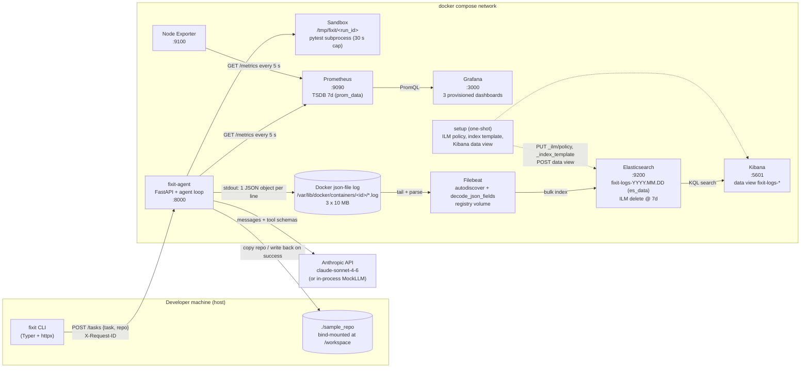

# fixit architecture

Pull-based metrics, push-based logs: Prometheus *scrapes* the agent and node exporter;
the agent never knows Prometheus exists. Logs go the other way: the agent only writes to
stdout, Docker persists that, and Filebeat *pushes* the parsed lines into Elasticsearch.

## Components

| Component | Role | Talks to | Stores data where | If it dies |
|---|---|---|---|---|
| fixit CLI | Thin client; sends the task, prints the result | agent (HTTP :8000) | nothing | Nothing else is affected; tasks can still be sent with curl. |
| fixit-agent | Runs the LLM loop, executes tools, exposes `/metrics`, writes JSON logs | Anthropic API (or MockLLM), sandbox, `/workspace` | In-memory task dict (lost on restart); sandbox copies under `/tmp/fixit` inside the container | Tasks fail with connection errors at the CLI. Prometheus marks the target DOWN (`up{job="agent"}=0`), all `fixit_*` series go stale. Logs stop flowing. Nothing already stored is lost. |
| Sandbox (inside agent) | Per-task copy of the repo; runs pytest with a 30 s timeout | agent filesystem | tmp dir, deleted at task end | A hung pytest is killed at 30 s and reported as `timeout`; the task continues. |
| Anthropic API / MockLLM | Proposes tool calls | agent | – | `LLMError` after 3 attempts -> task outcome `error`, HTTP 503, `fixit_llm_requests_total{status="error"}` rises. Mock never fails unless `FIXIT_FAULT=flaky`. |
| Prometheus | Scrapes agent/node/self every 5 s, stores series, answers PromQL | agent, node-exporter, Grafana | `prom_data` volume (7 d retention) | Grafana panels show "No data". The agent keeps counting in memory: counters are cumulative, so when Prometheus returns it sees the current totals and `rate()` bridges the gap (with one missing window). Scrapes that did not happen are lost forever. |
| Grafana | Dashboards over Prometheus | Prometheus | `grafana_data` volume (users, prefs); dashboards are re-provisioned from files | No visualisation, but no data loss: everything is still in Prometheus. |
| Node Exporter | Exposes CPU/mem/disk/net of the kernel it runs on (Docker Desktop VM here) | Prometheus | – | Node panels stop; app metrics unaffected. |
| Docker json-file driver | Captures agent stdout to `/var/lib/docker/containers/<id>/<id>-json.log` | Filebeat (reads the files) | 3 files x 10 MB per container, rotated | Not a separate process: if the Docker daemon is down nothing runs anyway. Rotation means lines older than ~30 MB are gone unless Filebeat already shipped them. |
| Filebeat | Tails the agent's log file, parses the JSON, sets `@timestamp`, ships to ES | Docker API (metadata), ES | `filebeat_registry` volume (read offsets) | Logs pile up in the Docker file (up to 30 MB) and are shipped when Filebeat returns, thanks to the registry. If ES is down Filebeat retries with backoff. |
| Elasticsearch | Stores and indexes log documents | Filebeat (writes), Kibana (reads) | `es_data` volume; daily index `fixit-logs-YYYY.MM.DD`; ILM deletes indices older than 7 d | Kibana shows an error; Filebeat buffers and retries. Metrics side unaffected. |
| Kibana | Search UI over ES | Elasticsearch | its own `.kibana` system indices inside ES | Search UI gone; data still queryable with `curl :9200/fixit-logs-*/_search`. |
| setup | One-shot: ILM policy, index template, Kibana data view | ES, Kibana | – | Runs once and exits 0. If it fails, indices still get created by Filebeat but without the ILM binding/explicit mapping; re-run with `docker compose up setup`. |

## Why this shape

* **Server + CLI split** so there are real HTTP requests to measure (response times, 5xx).
* **Single agent process, single Prometheus target**: no multiprocess registry complexity.
* **Named volumes** for anything that must survive `docker compose down`; bind mounts for
  config so the repo is the source of truth; `down -v` is the documented way to wipe.
* **IDs in logs, not labels**: `run_id`/`request_id` live in structured logs (unbounded
  cardinality is fine in Elasticsearch); Prometheus labels stay bounded (see Part E.2).
